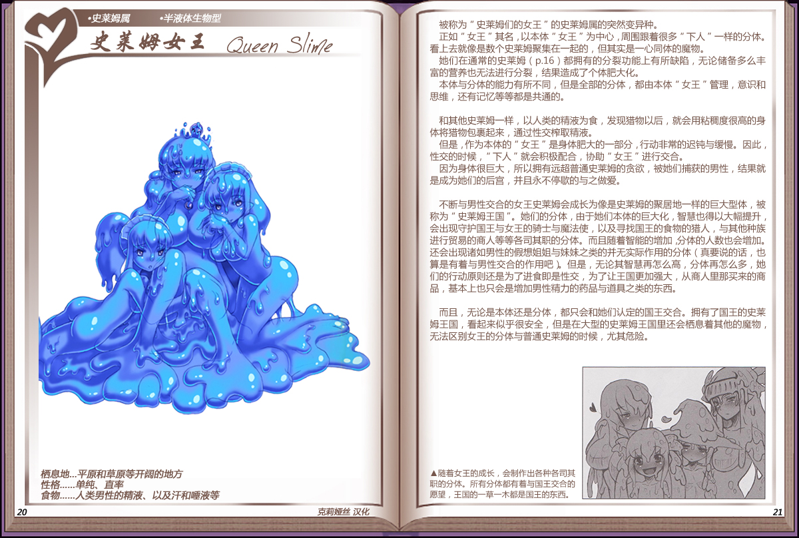

# 史莱姆女王

|名称|史莱姆女王|
|:-:|:-:|
|种属|史莱姆属|
|类型|半液体生物型|
|栖息地|草原、平原、洞窟等|
|性格|单纯、直率|
|食物|人类男性的元精|

被称为"史莱姆们的女王"的史莱姆属的突然变异种。

正如"女王"其名，以本体"女王"为中心，周围跟着很多"下人"一样的分体。看上去就像是数个史莱姆聚集在一起的，但其实是一心同体的魔物。

她们在通常的[史莱姆](03史莱姆.md)都拥有的分裂功能上有所缺陷，无论储备多么丰富的营养也无法进行分裂，结果造成了个体肥大化。

本体与分体的能力有所不同，但是全部的分体，都由本体"女王"管理，意识和思维，还有记忆等等都是共通的。

 

和其他史莱姆一样，以人类的精液为食，发现猎物以后，就会用粘稠度很高的身体将猎物包裹起来，通过性交榨取精液。

但是，作为本体的"女王"是身体肥大的一部分，行动非常的迟钝与缓慢。因此，性交的时候，"下人"就会积极配合，协助"女王"进行交合。

因为身体很巨大，所以拥有远超普通史莱姆的贪欲，被她们捕获的男性，结果就是成为她们的后宫，并且永不停歇的与之做爱。

 

不断与男性交合的女王史莱姆会成长为像是史莱姆的聚居地一样的巨大型体，被称为"史莱姆王国"。她们的分体，由于她们本体的巨大化，智慧也得以大幅提升，会出现守护国王与女王的骑士与魔法使，以及寻找国王的食物的猎人，与其他种族进行贸易的商人等等各司其职的分体。而且随着智能的增加分体的人数也会增加。还会出现诸如男性的假想姐姐与妹妹之类的并无实际作用的分体（真要说的话，也算是有着与男性交合的作用吧）。但是，无论其智慧再怎么高，分体再怎么多，她们的行动原则还是为了进食即是性交，为了让王国更加强大，从商人里那买来的商品，基本上也只会是增加男性精力的药品与道具之类的东西。

 

而且，无论是本体还是分体，都只会和她们认定的国王交合。拥有了国王的史莱姆王国，看起来似乎很安全，但是在大型的史莱姆王国里还会栖息着其他的魔物，无法区别女王的分体与普通史莱姆的时候，尤其危险。

------------------------------------------------------------------------

附图： 
