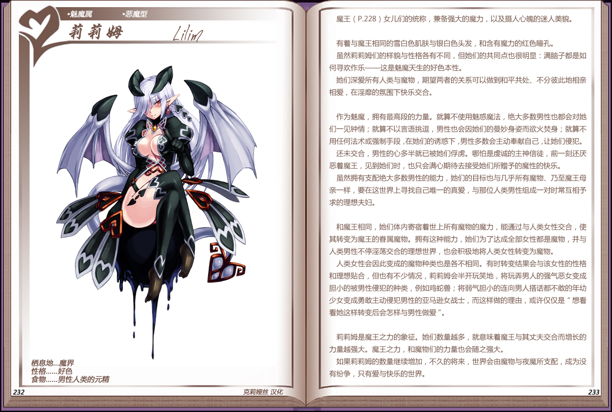

# 莉莉姆

|名称|莉莉姆|
|:-:|:-:|
|种属|魅魔属|
|类型|恶魔型|
|栖息地|魔界|
|性格|好色|
|食物|男性人类的元精|

[魔王](资料魔界.md)女儿们的统称，兼备强大的魔力，以及摄人心魄的迷人美貌.

 

有着与魔王相同的雪白色肌肤与银白色头发，和含有魔力的红色瞳孔

虽然莉莉姆们的样貌与性格各有不同，但她们的共同点也很明显：满脑子都是如何寻欢作乐——这是魅魔天生的好色本性。

她们深爱所有人类与魔物，期望两者的关系可以做到和平共处、不分彼此地相亲相爱，在淫靡的氛围下快乐交合。

 

作为魅魔，拥有最高段的力量。就算不使用魅惑魔法，绝大多数男性也都会对她们一见钟情；就算不以言语挑逗，男性也会因她们的曼妙身姿而欲火焚身；就算不用任何法术或强制手段，在她们的诱惑下，男性多数会主动奉献自己，让她们侵犯。

还未交合，男性的心多半就已被她们俘虏。哪怕是虔诚的主神信徒，前一刻还厌恶着魔王，见到她们时，也只会满心期待去接受她们所赠予的魔性的快乐。

虽然拥有支配绝大多数男性的能力，她们的目标也与几乎所有魔物、乃至魔王母亲一样，要在这世界上寻找自己唯一的真爱，与那位人类男性组成一对时常互相予求的理想夫妇。

 

和魔王相同，她们体内寄宿着世上所有魔物的魔力，能通过与人类女性交合，使其转变为魔王的誉属魔物。拥有这种能力，她们为了达成全部女性都是魔物，并与人类男性不停淫荡交合的理想世界，也会积极地将人类女性转变为魔物。

人类女性会因此变成的魔物种类也是各不相同。有时转变结果会与该女性的性格和理想贴合，但也有不少情况，莉莉姆会半开玩笑地，将玩弄男人的强气恶女变成胆小的被男性侵犯的种类，例如鸡蛇兽；将弱气胆小的连向男人搭话都不敢的年幼少女变成勇敢主动侵犯男性的亚马逊女战士，而这样做的理由，或许仅仅是“想看看她这样转变后会怎样与男性做爱”。

 

莉莉姆是魔王之力的象征。她们数量越多，就意味着魔王与其丈夫交合而增长的力量越强大。魔王之力，和魔物们的力量也会随之强大。

如果莉莉姆的数量继续增加，不久的将来，世界会由魔物与夜魔所支配，成为没有纷争，只有爱与快乐的世界。

---

附图： 