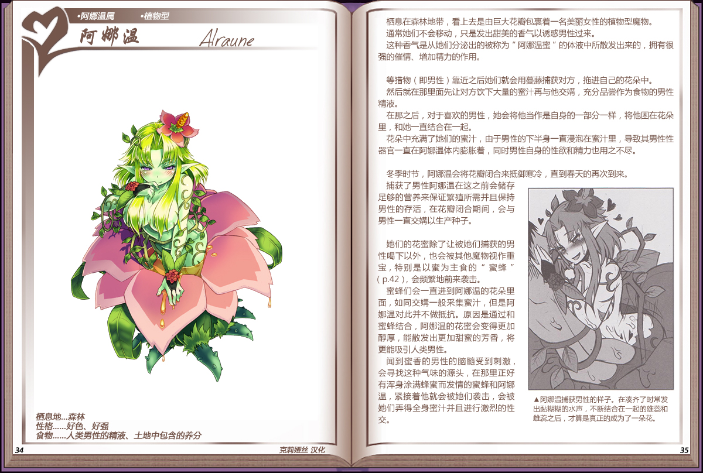

# 阿娜温

|名称|阿娜温|
|:-:|:-:|
|种属|阿娜温属|
|类型|植物型|
|栖息地|好色、好强|
|性格|强气、固执|
|食物|人类男性的元精、土地中包含的养分|

栖息在森林地带，看上去是由巨大花瓣包裹着一名美丽女性的植物型魔物。

通常她们不会移动，只是发出甜美的香气以诱惑男性过来。

这种香气是从她们分泌出的被称为"阿娜温蜜"的体液中所散发出来的，拥有很强的催情、增加精力的作用。

 

等猎物（即男性）靠近之后她们就会用蔓藤捕获对方，拖进自己的花朵中。

然后就在那里面先让对方饮下大量的蜜汁再与他交媾，充分品尝作为食物的男性精液。

在那之后，对于喜欢的男性，她会将他当作是自身的一部分一样，将他困在花朵里，和她一直结合在一起。

花朵中充满了她们的蜜汁，由于男性的下半身一直浸泡在蜜汁里，导致其男性性器官一直在阿娜温体内膨胀着，同时男性自身的性欲和精力也用之不尽。

 

冬季时节，阿娜温会将花瓣闭合来抵御寒冷，直到春天的再次到来。捕获了男性阿娜温在这之前会储存足够的营养来保证繁殖所需并且保持男性的存活，在花瓣闭合期间，会与男性一直交媾以生产种子。

 

她们的花蜜除了让被她们捕获的男性喝下以外，也会被其他魔物视作重宝，特别是以蜜为主食的["蜜蜂"](16蜜蜂.md)，会频繁地前来袭击。

蜜蜂们会一直进到阿娜温的花朵里面，如同交媾一般采集蜜汁，但是阿娜温对此并不做抵抗。原因是通过和蜜蜂结合，阿娜温的花蜜会变得更加醇厚，能散发出更加甜蜜的芳香，将更能吸引人类男性。

闻到蜜香的男性的脑随受到刺激，会寻找这种气味的源头，在那里正好有浑身涂满蜂蜜而发情的蜜蜂和阿娜温，紧接着他就会被她们袭击，会被她们弄得全身蜜汁并且进行激烈的性交。

---

附图： 
