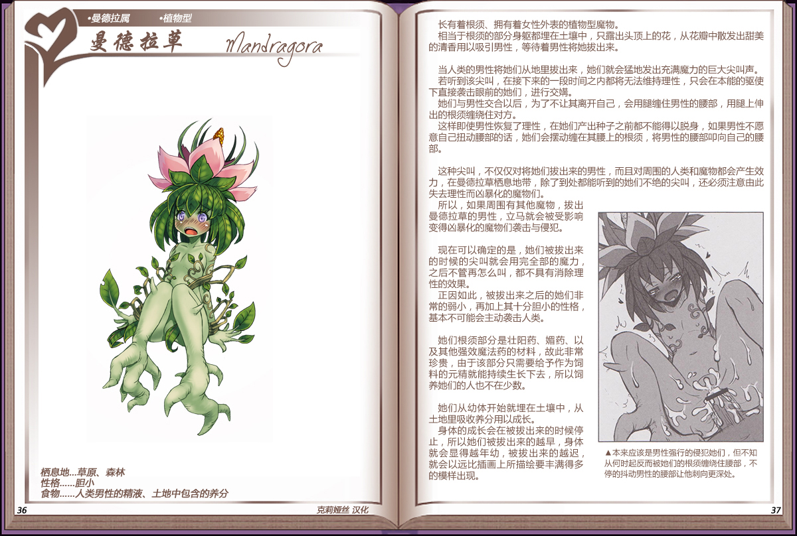

# 曼德拉草

|名称|曼德拉草|
|:-:|:-:|
|种属|曼德拉属|
|类型|植物型|
|栖息地|草原、森林|
|性格|胆小|
|食物|人类男性的元精、土地中包含的养分|

长有着根须、拥有着女性外表的植物型魔物。

相当于根须的部分身躯都埋在土壤中，只露出头顶上的花，从花瓣中散发出甜美的清香用以吸引男性，等待着男性将她拔出来。

 

当人类的男性将她们从地里拔出来，她们就会猛地发出充满魔力的巨大尖叫声。

若听到该尖叫，在接下来的一段时间之内都将无法维持理性，只会在本能的驱使下直接袭击眼前的她们，进行交媾。

她们与男性交合以后，为了不让其离开自己，会用腿缠住男性的腰部，用腿上伸出的根须缠绕住对方。

这样即使男性恢复了理性，在她们产出种子之前都不能得以脱身，如果男性不愿意自己扭动腰部的话，她们会摆动缠在其腰上的根须，将男性的腰部叩向自己的腰部。

 

这种尖叫，不仅仅对将她们拔出来的男性，而且对周围的人类和魔物都会产生效力，在曼德拉草栖息地带，除了到处都能听到的她们不绝的尖叫，还必须注意由此失去理性而凶暴化的魔物们。

所以，如果周围有其他魔物，拔出曼德拉草的男性，立马就会被受影响变得凶暴化的魔物们袭击与侵犯。

 

现在可以确定的是，她们被拔出来的时候的尖叫就会用完全部的魔力，之后不管再怎么叫，都不具有消除理性的效果。

正因如此，被拔出来之后的她们非常的弱小，再加上其十分胆小的性格基本不可能会主动袭击人类。

 

她们根须部分是壮阳药、媚药、以及其他强效魔法药的材料，故此非常珍贵，由于该部分只需要给予作为饲料的元精就能持续生长下去，所以饲养她们的人也不在少数。

 

她们从幼体开始就埋在土壤中，从土地里吸收养分用以成长。

身体的成长会在被拔出来的时候停止，所以她们被拔出来的越早，身体就会显得越年幼，被拔出来的越迟，就会以远比插画士所描绘要丰满得多的模样出现。

----

附图： 
