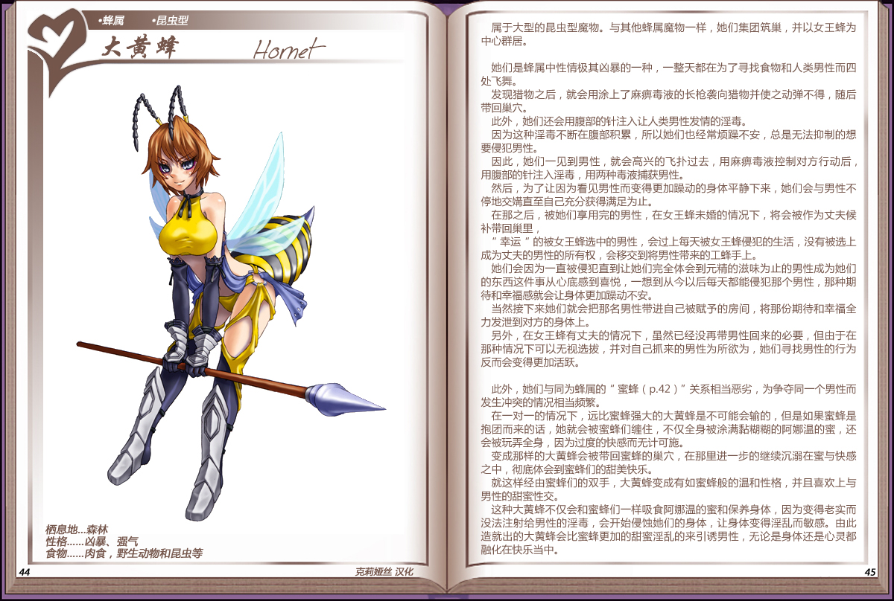

# 大黄蜂

|名称|大黄蜂|
|:-:|:-:|
|种属|蜂属|
|类型|昆虫型|
|栖息地|森林|
|性格|凶暴、强气|
|食物|肉食，野肉食，野生动物和昆虫等生动物等|

属于大型的昆虫型魔物。与其他蜂属魔物一样，她们集团筑巢，并以女王蜂为中心群居。

 

她们是蜂属中性情极其凶暴的一种，一整天都在为了寻找食物和人类男性而四处飞舞。

发现猎物之后，就会用涂上了麻痹毒液的长枪袭向猎物并使之动弹不得，随后带回巢穴。

此外，她们还会用腹部的针注入让人类男性发情的淫毒。

因为这种淫毒不断在腹部积累，所以她们也经常烦躁不安，总是无法抑制的想要侵犯男性。

因此，她们一见到男性，就会高兴的飞扑过去，用麻痹毒液控制对方行动后，用腹部的针注入淫毒，用两种毒液捕获男性。

然后，为了让因为看见男性而变得更加躁动的身体平静下来，她们会与男性不停地交媾直至自己充分获得满足为止。

在那之后，被她们享用完的男性，在女王蜂未婚的情况下，将会被作为丈夫候补带回巢里，

"幸运"的被女王蜂选中的男性，会过上每天被女王蜂侵犯的生活，没有被选上成为丈夫的男性的所有权，会移交到将男性带来的工蜂手上。

她们会因为一直被侵犯直到让她们完全体会到元精的滋味为止的男性成为她们的东西这件事从心底感到喜悦，一想到从今以后每天都能侵犯那个男性，那种期待和幸福感就会让身体更加躁动不安。

当然接下来她们就会把那名男性带进自己被赋予的房间，将那份期待和幸福全力发泄到对方的身体上。

另外，在女王蜂有丈夫的情况下，虽然已经没再带男性回来的必要，但由于在那种情况下可以无视选拔，并对自己抓来的男性为所欲为，她们寻找男性的行为反而会变得更加活跃。

 

此外，她们与同为蜂属的["蜜蜂"](16蜜蜂.md)关系相当恶劣，为争夺同一个男性而发生冲突的情况相当频繁。

在一对一的情况下，远比蜜蜂强大的大黄蜂是不可能会输的，但是如果蜜蜂是抱团而来的话，她就会被蜜蜂们缠住，不仅全身被涂满黏糊糊的阿娜温的蜜，还会被玩弄全身，因为过度的快感而无计可施。

变成那样的大黄蜂会被带回蜜蜂的巢穴，在那里进一步的继续沉溺在蜜与快感之中，彻底体会到蜜蜂们的甜美快乐。

就这样经由蜜蜂们的双手，大黄蜂变成有如蜜蜂般的温和性格，并且喜欢上与男性的甜蜜性交。

这种大黄蜂不仅会和蜜蜂们一样吸食阿娜温的蜜和保养身体，因为变得老实而没法注射给男性的淫毒，会开始侵蚀她们的身体，让身体变得淫乱而敏感。由此造就出的大黄蜂会比蜜蜂更加的甜蜜淫乱的来引诱男性，无论是身体还是心灵都融化在快乐当中。

---

附图： 
