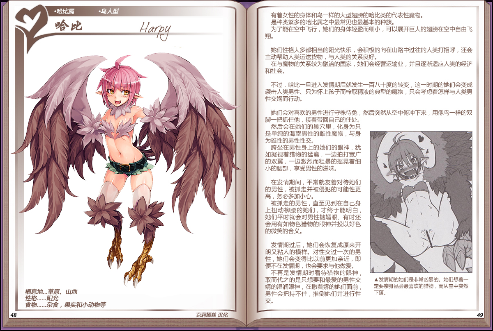
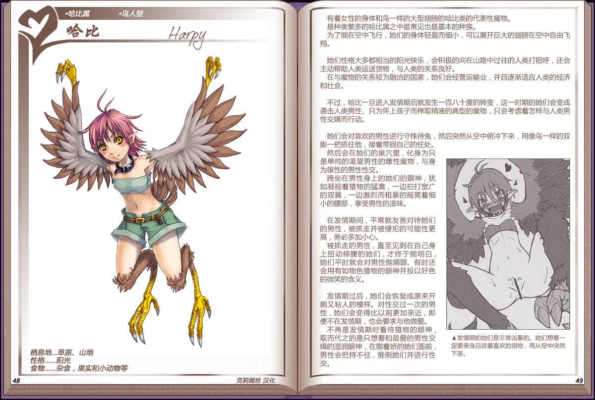

# 哈比

|名称|哈比|
|:-:|:-:|
|种属|哈比属|
|类型|鸟人型|
|栖息地|草原、山地|
|性格|阳光|
|食物|杂食、果实和小动物等|

有着女性的身体和鸟一样的大型翅膀的哈比类的代表性魔物。

是种类繁多的哈比属之中最常见也最基本的种族。

为了能在空中飞行，她们的身体轻盈而细小，可以展开巨大的翅膀在空中自由飞翔。

 

她们性格大多都相当的阳光快乐，会积极的向在山路中过往的人类打招呼，还会主动帮助人类运送货物，与人类的关系良好。

在与魔物的关系较为融洽的国家，她们会经营运输业，并且逐渐适应人类的经济和社会。

 

不过，哈比一旦进入发情期后就发生一百八十度的转变，这一时期的她们会变成袭击人类男性、只为怀上孩子而榨取精液的典型的魔物，只会考虑着怎样与人类男性交媾而行动。

 

她们会对喜欢的男性进行守株待兔，然后突然从空中俯冲下来，用像鸟一样的双脚一把抓住他，接着带回自己的住处。

然后会在她们的巢穴里，化身为只是单纯的渴望男性的雌性魔物，与身为雄性的男性性交。

跨坐在男性身上的她们的眼神，犹如凝视着猎物的猛禽，一边拍打宽广的双翼，一边激烈而粗暴的摇晃着细小的腰部，享受男性的滋味。

 

在发情期间，平常就友善对待她们的男性，被抓走并被侵犯的可能性更高，务必多加小心。

被抓走的男性，直至见到在自己身上扭动柳腰的她们，才终于能明白，她们平时就会对男性抛媚眼、有时还会用有如物色猎物的眼神并投以好色的微笑的含义。

 

发情期过后，她们会恢复成原来开朗又粘人的模样。对性交过一次的男性，她们会变得比以前更加亲近，即便不在发情期，也会要求与他做爱。

不再是发情期时看待猎物的眼神，取而代之的是只想要和最爱的男性交媾的湿润眼神，在撒着娇的她们面前，男性会把持不住，推倒她们并进行性交。

---

附图： 

---

旧版： 
