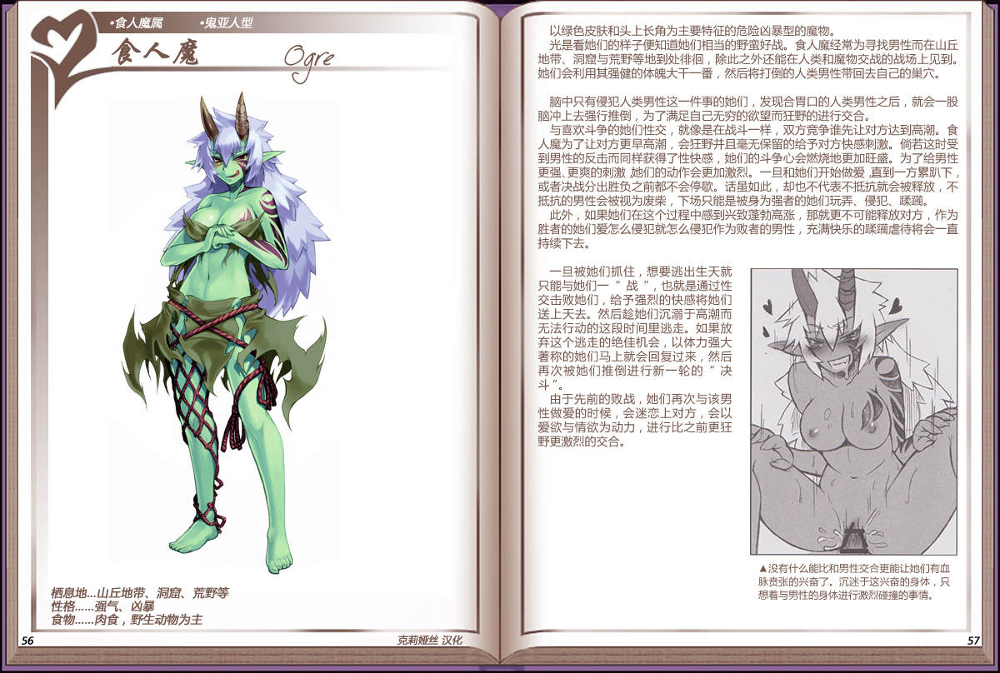

# 食人魔

|名称|食人魔|
|:-:|:-:|
|种属|食人魔属|
|类型|鬼亚人型|
|栖息地|山丘地带、洞窟、荒野等|
|性格|强气、凶暴|
|食物|肉食，野生动物为主|

以绿色皮肤和头上长角为主要特征的危险凶暴型的魔物。

光是看她们的样子便知道她们相当的野蛮好战。食人魔经常为寻找男性而在山丘地带、洞窟与荒野等地到处徘徊，除此之外还能在人类和魔物交战的战场上见到。她们会利用其强健的体魄大干一番，然后将打倒的人类男性带回去自己的巢穴。

 

脑中只有侵犯人类男性这一件事的她们，发现合胃口的人类男性之后，就会一股脑冲上去强行推倒，为了满足自己无穷的欲望而狂野的进行交合。

与喜欢斗争的她们性交，就像是在战斗一样，双方竞争谁先让对方达到高潮。食人魔为了让对方更早高潮，会狂野并且毫无保留的给予对方快感刺激。倘若这时受到男性的反击而同样获得了性快感，她们的斗争心会燃烧地更加旺盛。为了给男性更强.更爽的刺激她们的动作会更加激烈。一旦和她们开始做爱直到一方累趴下，或者决战分出胜负之前都不会停歇。话虽如此，却也不代表不抵抗就会被释放，不抵抗的男性会被视为废柴，下场只能是被身为强者的她们玩弄、侵犯、蹂躏。

此外，如果她们在这个过程中感到兴致蓬勃高涨，那就更不可能释放对方，作为胜者的她们爱怎么侵犯就怎么侵犯作为败者的男性，充满快乐的蹂躏虐待将会一直持续下去。

 

一旦被她们抓住，想要逃出生天就只能与她们一"战"，也就是通过性交击败她们，给予强烈的快感将她们送上天去。然后趁她们沉溺于高潮而无法行动的这段时间里逃走。如果放弃这个逃走的绝佳机会，以体力强大著称的她们马上就会回复过来，然后再次被她们推倒进行新一轮的"决斗"。

由于先前的败战，她们再次与该男性做爱的时候，会迷恋上对方，会以爱欲与情欲为动力，进行比之前更狂野更激烈的交合。

---

附图： 
