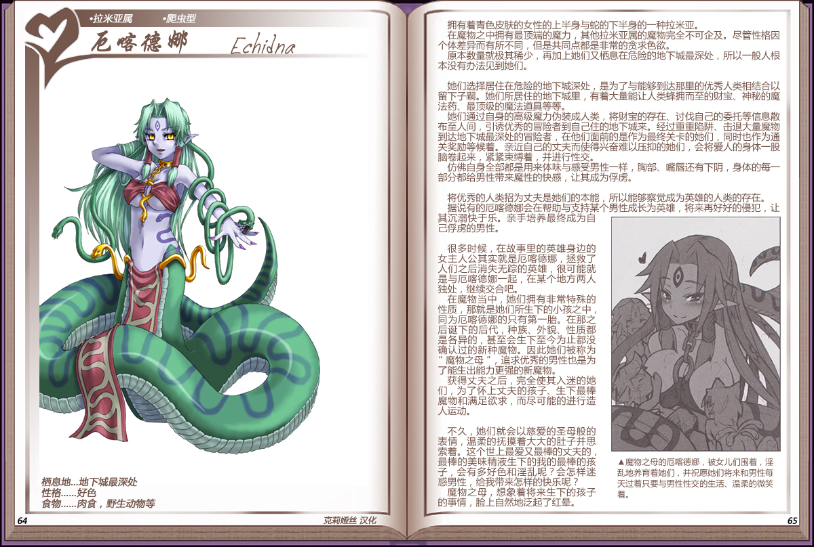

# 厄喀德娜

|名称|厄喀德娜|
|:-:|:-:|
|种属|拉米亚属|
|类型|爬虫型|
|栖息地|地下城最深处|
|性格|好色|
|食物|肉食，野生动物等|

拥有着青色皮肤的女性的上半身与蛇的下半身的一种拉米亚。

在魔物之中拥有最顶端的魔力，其他拉米亚属的魔物完全不可企及。尽管性格因个体差异而有所不同，但是共同点都是非常的贪求色欲。

原本数量就极其稀少，再加上她们又栖息在危险的地下城最深处，所以一般人根本没有办法见到她们。

 

她们选择居住在危险的地下城深处，是为了与能够到达那里的优秀人类相结合以留下子嗣。她们所居住的地下城里，有着大量能让人类蜂拥而至的财宝、神秘的魔法药、最顶级的魔法道具等等。

她们通过自身的高级魔力伪装成人类，将财宝的存在、讨伐自己的委托等信息散布至人间，引诱优秀的宫险者到自己在的地下城来。经过重重陷阱、击退夭量魔物到达地下城最深处的冒险者，在他们面前的是作为最终关卡的她们，同时也作为通关奖励等候着。亲近自己的丈天而使得兴奋难以压抑的她们，会将爱人的身体一股脑卷起来，紧紧束缚着，并进行性交。

仿佛自身全部都是用来体味与感受男性一样，胸部、嘴唇还有下阴，身体的每一部分都给男性带来魔性的快感，让其成为俘虏。

 

将优秀的人类招为丈夫是她们的本能，所以能够察觉成为英雄的人类的存在。

据说有的厄喀德娜会在帮助与支持某个男性成长为英雄，将来再好好的侵犯，让其沉溺于快乐。亲手培养最终成为自己俘虏的勇性。

 

很多时候，在故事里的英雄身边的女主人公其实就是厄喀德娜，拯救了人们之后消失无踪的英雄，很可能就是与厄喀德娜一起，在某个地方两人独处，继续交合吧。

在魔物当中，她们拥有非常特殊的性质，那就是她们所生下的小孩之中，同为厄喀德娜的只有第一胎。在那之后诞下的后代，种族、外貌、性质都是各异的，甚至会生下至今为正都没确认过的新种魔物。因此她们被称为"魔物之母"，追求优秀的男性也是为了能生出能力更强的新魔物。

获得丈夫之后，完全使其入迷的她们，为了怀上丈夫的孩子、生下最棒魔物和满足欲求，而尽可能的进行造人运动。

 

不久，她们就会以慈爱的圣母般的表情，温柔的抚摸着天天的肚子并思索着。这个世上最爱又最棒的丈夫的，最棒的美味精液生下的我的最棒的孩子，会有多好色和淫乱呢？会怎样迷惑男性，给我带来怎样的快乐呢？

魔物之母，想象着将来生下的孩子的事情，脸上自然地泛起了红晕。

---

附图： 
