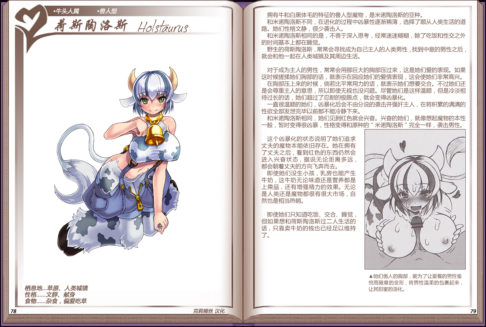

# 荷斯陶洛斯

|名称|荷斯陶洛斯|
|:-:|:-:|
|种属|牛头人属|
|类型|兽人型|
|栖息地|草原、人类城镇|
|性格|文静、献身|
|食物|杂食、偏爱吃草|

拥有牛和白黑体毛的特征的兽人型魔物，是米诺陶洛斯的亚种。

和米诺陶洛斯不同，在进化的过程中凶暴性逐渐稀薄，选择了顺从人类生活的道路。她们性格文静，很少袭击人。

和米诺陶洛斯相同的是，不善于深入思考，经常迷迷糊糊，除了吃饭和性交之外的时间基本上都在睡觉。

野生的荷斯陶洛斯，常常会寻找成为自己主人的人类男性，找到中意的男性之后，就会和他一起在人类城镇及其周边生活。

 

对于成为主人的男性，常常会用那巨大的胸部压过来，这是她们爱的表现。

如果这时候搓揉她们胸部的话，就表示在回应她们的爱情表现，这会使她们非常高兴。在胸部压上来的时候，倘若比平常用力的话，就表示她们想要交合。不过她们还是会尊重主人的意思，所以即使无视也没问题。尽管她们是这样温顺，但是冷淡相待过长的话。她们超过了忍耐的极限点,就会变得凶暴化。

一直很温顺的她们，凶暴化后会不由分说的袭击并强奸主人，在将积累的满满的性欲全部发泄完毕以前都不能冷静下来。

和米诺陶洛斯相同，她们见到红色就会兴奋。兴奋的她们，就像想起魔物的本性一般，暂时变得很凶暴，性格变得和原种的"米诺陶洛斯"完全一样，袭击男性。

 

这个凶暴化的状态说明了她们追求丈夫的魔物本能依旧存在。她在拥有了丈夫之后，看到红色的东西仍然会进入兴奋状态,据说无论距离多远,都会朝着丈夫的方向飞奔而去。

即使她们没生小孩，乳房也能产生牛奶，这牛奶无论味道还是营养都是上乘品,还有增强精力的效果。无论是人类还是魔物都很有很大市场。自然也是相当热销。

 

即使她们只知道吃饭、交合、睡觉,但如果想和荷斯陶洛斯过二人生活的话,只靠卖牛奶的钱也已经足以维持了。

---

附图： 
