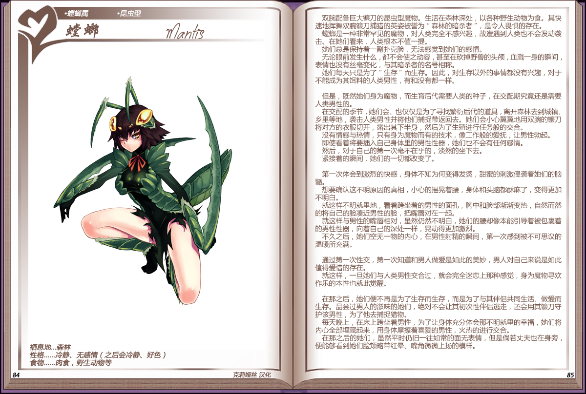

# 螳螂

|名称|螳螂|
|:-:|:-:|
|种属|螳螂属|
|类型|昆虫型|
|栖息地|森林|
|性格|冷静、无感情（之后会冷静、好色）|
|食物|肉食，野生动物等|

双腕配备巨大镰刀的昆虫型魔物。生活在森林深处，以各种野生动物为食。其快速地挥舞双腕镰刀捕猎的英姿被誉为"森林的暗杀者"，是令人畏惧的存在。

螳螂是一种非常罕见的魔物，对人类完全不感兴趣，故遭遇到人类也不会发动袭击。在她们看来，人类根本不值一提。

她们总是保持着一副扑克脸，无法感觉到她们的感情。

无论眼前发生什么，都不会使之动容，甚至在砍掉野兽的头颅，血溅一身的瞬间，表情也没有丝毫变化，与其暗杀者的名号相称。

她们每天只是为了"生存"而生存。因此，对生存以外的事情都没有兴趣，对于不能成为其饵料的人类男性，有和没有都一样。

 

但是，既然她们身为魔物，而生育后代需要人类的种子，在交配期究竟还是需要人类男性的。

在交配的季节，她们会、也仅仅是为了寻找繁衍后代的道具，离开森林去到城镇、乡里等地，袭击人类男性并将他们捕捉带返回去。她们会小心翼翼地用双腕的镰刀将对方的衣服切开，露出其下半身，然后为了生殖进行任务般的交合。

没有情感与热情，只有身为魔物而有的技术，像工作般的爱抚，让男性勃起。

即使看着将要插入自己身体里的男性性器，她们也不会有任何感情。

然后，对于自己的第一次毫不在乎的，淡然的坐下去。

紧接着的瞬间，她们的一切都改变了。

 

第一次体会到激烈的快感，身体不知为何变得发烫，甜蜜的刺激侵袭着她们的脑髓。

想要确认这不明原因的真相，小心的摇晃着腰，身体和头脑都酥麻了，变得更加不明白。

就这样不明就里地，看着跨坐着的男性的面孔，胸中和脸部渐渐变热，自然而然的将自己的脸凑近男性的脸，把嘴唇对在一起。

就这样与男性的嘴唇相对，虽然仍然不明百，她们的腰却像本能引导着被包裹着的男性性器，向着自己的深处一样，晃动得更加激烈。

不久之后，她们空无一物的内心，在男性射精的瞬间，第一次感到被不可思议的温暖所充满。

 

通过第一次性交，第一次知道和男人做爱是如此的美妙，男人对自己来说是如此值得爱惜的存在。

就这样，一旦她们与人类男性交合过，就会完全迷恋上那种感觉，身为魔物寻欢作乐的本性也就此觉醒。

 

在那之后，她们便不再是为了生存而生存，而是为了与其伴侣共同生活、做爱而生存。品尝过男人的滋味的她们，绝对不会让其初次性伴侣逃走，还会用其镰刀守护该男性，为了他去捕捉猎物。

每天晚上，在床上跨坐着男性，为了让身体充分体会那不明就里的幸福，她们将内心全部埋藏起来，用身体摩擦着喜爱的男性，火热的进行交合。

在那之后的她们，虽然平时仍旧一往如常的面无表情，但是倘若丈夫也在身旁，便能够看到她们脸颊略带红晕、嘴角微微上扬的模样。

---

附图： 
