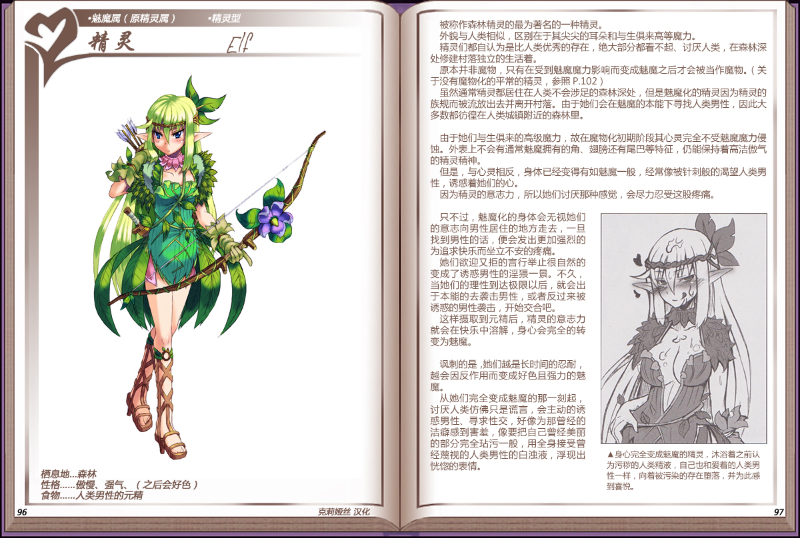

# 精灵

|名称|精灵|
|:-:|:-:|
|种属|魅魔属（原精灵属）|
|类型|精灵型|
|栖息地|森林|
|性格|傲慢、强气、（之后会好色）|
|食物|人类男性的元精|

被称作森林精灵的最为著名的一种精灵。

外貌与人类相似，区别在于其尖尖的耳朵和与生俱来高等魔力。

精灵们都自认为是比人类优秀的存在，绝大部分都看不起、讨厌人类，在森林深处修建村落独立的生活着。

原本并非魔物，只有在受到魅魔魔力影响而变成魅魔之后才会被当作魔物。(关于没有魔物化的平常的精灵，参照P.102)

虽然通常精灵都居住在人类不会涉足的森林深处，但是魅魔化的精灵因为精灵的族规而被流放出去并离开村落。由于她们会在魅魔的本能下寻找人类男性，因此大多数都彷徨在人类城镇附近的森林里。

 

由于她们与生俱来的高级魔力，故在魔物化初期阶段其心灵完全不受魅魔魔力侵蚀。外表上不会有通常魅魔拥有的角、翅膀还有尾巴等特征，仍能保持着高洁傲气的精灵精神。

但是，与心灵相反，身体已经变得有如魅魔一般，经常像被针刺般的渴望人类男性，诱惑着她们的心。

因为精灵的意志力，所以她们讨厌那种感觉，会尽力忍受这股疼痛。

 

只不过，魅魔化的身体会无视她们的意志向男性居住的地方走去，一旦找到男性的话，便会发出更加强烈的为追求快乐而坐立不安的疼痛。

她们欲迎又拒的言行举止很自然的变成了诱惑男性的淫猥一景。不久，当她们的理性到达极限以后，就会出于本能的去袭击男性，或者反过来被诱惑的男性袭击，开始交合吧。

这样摄取到元精后，精灵的意志力就会在快乐中溶解，身心会完全的转变为魅魔。

 

讽刺的是，她们越是长时间的忍耐越会因反作用而变成好色且强力的魅魔。

从她们完全变成魅魔的那一刻起讨厌人类仿佛只是谎言，会主动的诱惑男性、寻求性交，好像为那曾经的洁癖感到害羞，像要把自己曾经美丽的部分完全玷污一般，用全身接受曾经蔑视的人类男性的白浊液，浮现出恍惚的表情。

---

附图： 
