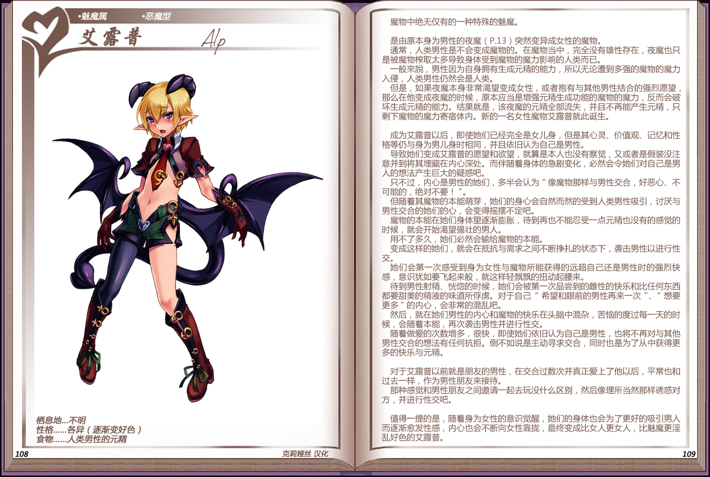

# 艾露普

|名称|艾露普|
|:-:|:-:|
|种属|魅魔属|
|类型|恶魔型|
|栖息地|不明|
|性格|各异（逐渐变好色）|
|食物|人类男性的元精|

魔物中绝无仅有的一种特殊的魅魔。

 

是由原本身为男性的[夜魔](资料魔物化.md#夜魔)突然变异成女性的魔物。

通常，人类男性是不会变成魔物的。在魔物当中，完全没有雄性存在，夜魔也只是被魔物榨取太多导致身体受到魔物的魔力影响的人类而已。

一般来说，男性因为自身拥有生成元精的能力，所以无论遭到多强的魔物的魔力入侵，人类男性仍然会是人类。

但是，如果夜魔本身非常渴望变成女性，或者抱有与其他男性结合的强烈愿望，那么在他变成夜魔的时候，原本应当是增强元精生成功能的魔物的魔力，反而会破坏生成元精的能力。结果就是，该夜魔的元精全部流失，并且不再能产生元精，只剩下魔物的魔力寄宿体内。新的一名女性魔物艾露普就此诞生。

 

成为艾露普以后，即使她们已经完全是女儿身，但是其心灵、价值观、记忆和性格等仍与身为男儿身时相同，并且依旧认为自己是男性。

导致她们变成艾露普的愿望和欲望，就算是本人也没有察觉，又或者是假装没注意并到将其埋藏在内心深处。而伴随着身体的急剧变化，必然会令她们对自己是男人的想法产生巨大的疑惑吧。

只不过，内心是男性的她们，多半会认为"像魔物那样与男性交合，好恶心、不可能的，绝对不要!
"。

但随着其魔物的本能萌芽，她们的身心会自然而然的受到人类男性吸引，讨厌与男性交合的她们的心，会变得摇摆不定吧。

魔物的本能在她们身体里逐渐膨胀，待到再也不能忍受一点元精也没有的感觉的时候，就会开始渴望强壮的男人。

用不了多久，她们必然会输给魔物的本能。

变成这样的她们，就会在抵抗与需求之间不断挣扎的状态下，袭击男性以进行性交。

她们会第一次感受到身为女性与魔物所能获得的远超自己还是男性时的强烈快感，意识犹如要飞起来般，就这样轻飘飘的扭动起腰来。

待到男性射精、恍惚的时候，她们会被第一次品尝到的雌性的快乐和比任何东西都要甜美的精液的味道所俘虏。对于自己"希望和眼前的男性再来一次"、"想要更多"的内心，会非常的混乱吧。

然后，就在她们男性的内心和魔物的快乐在头脑中混杂，苦恼的度过每一天的时候，会随着本能，再次袭击男性并进行性交。

随着做爱的次数增多，很快，即使她们依旧认为自己是男性，也将不再对与其他男性交合的想法有任何抗拒。倒不如说是主动寻求交合，同时也是为了从中获得更多的快乐与元精。

 

对于艾露普以前就是朋友的男性，在交合过数次并真正爱上了他以后，平常也和过去一样，作为男性朋友来接待。

那种感觉和男性朋友之间邀请一起去玩没什么区别，然后像理所当然那样诱惑对方，并进行性交吧。

 

值得一提的是，随着身为女性的意识觉醒，她们的身体也会为了更好的吸引男人而逐渐愈发性感，内心也会不断向女性靠拢，最终变成比女人更女人，比魅魔更淫乱好色的艾露普。

---

附图： 
