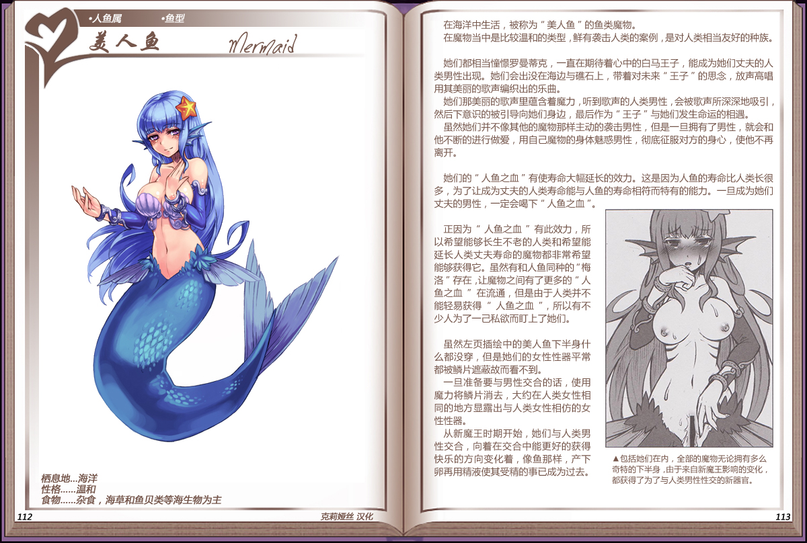

# 美人鱼

|名称|美人鱼|
|:-:|:-:|
|种属|人鱼属|
|类型|鱼型|
|栖息地|海洋|
|性格|温和|
|食物|杂食，海草和鱼贝类等海生物为主|

在海洋中生活，被称为"美人鱼"的鱼类魔物。

在魔物当中是比较温和的类型，鲜有袭击人类的案例，是对人类相当友好的种族。

 

她们都相当憧憬罗曼蒂克，一直在期待着心中的白马王子，能成为她们丈夫的人类男性出现。她们会出没在海边与礁石上，带着对未来"王子"的思念，放声高唱用其美丽的歌声编织出的乐曲。

她们那美丽的歌声里蕴含着魔力，听到歌声的人类男性，会被歌声所深深地吸引，然后下意识的被引导向她们身边，最后作为"王子"与她们发生命运的相遇。

虽然她们并不像其他的魔物那样主动的袭击男性，但是一旦拥有了男性，就会和他不断的进行做爱，用自己魔物的身体魅惑男性，彻底征服对方的身心，使他不再离开。

 

她们的"人鱼之血"有使寿命大幅延长的效力。这是因为人鱼的寿命比人类长很多，为了让成为丈夫的人类寿命能与人鱼的寿命相符而特有的能力。一旦成为她们丈夫的男性，一定会喝下"人鱼之血"。

 

正因为"人鱼之血"有此效力，所以希望能够长生不老的人类和希望能延长人类丈夫寿命的魔物都非常希望能够获得它。虽然有和人鱼同种的"梅洛"存在，让魔物之间有了更多的"人鱼之血"在流通，但是由于人类并不能轻易获得"人鱼之血"，所以有不少人为了一己私欲而盯上了她们。

 

虽然左页插绘中的美人鱼下半身什么都没穿，但是她们的女性性器平常都被鳞片遮蔽故而看不到。

一旦准备要与男性交合的话，使用魔力将鳞片消去，大约在人类女性相同的地方显露出与人类女性相仿的女性性器。

从新魔王时期开始，她们与人类男性交合，向着在交合中能更好的获得快乐的方向变化着，像鱼那样，产下卵再用精液使其受精的事已成为过去。

------------------------------------------------------------------------

附图： 
