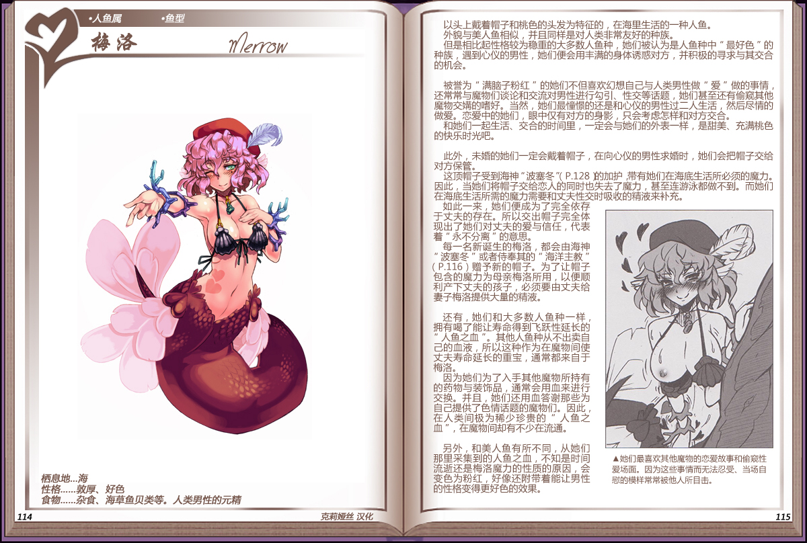

# 梅洛

|名称|梅洛|
|:-:|:-:|
|种属|人鱼属|
|类型|鱼型|
|栖息地|海|
|性格|敦厚、好色|
|食物|杂食、海草鱼贝类等。人类男性的元精|

以头上戴着帽子和桃色的头发为特征的，在海里生活的一种人鱼

外貌与美人鱼相似，并且同样是对人类非常友好的种族。

但是相比起性格较为稳重的大多数人鱼种，她们被认为是人鱼种中"最好色"的种族，遇到心仪的男性，她们便会用丰满的身体诱惑对方，并积极的寻求与其交合的机会。

 

被誉为"满脑子粉红"的她们不但喜欢幻想自己与人类男性做"爱"做的事情还常常与魔物们谈论和交流对男性进行勾引、性交等话题，她们甚至还有偷窥其他魔物交端的嗜好。当然，她们最憧憬的还是和心仪的男性过二人生活，然后尽情的做爱。恋爱中的她们，眼中仅有对方的身影，只会考虑怎样和对方交合

和她们一起生活、交合的时间里，一定会与她们的外表一样，是甜美、充满桃色的快乐时光吧。

 

此外，未婚的她们一定会戴着帽子，在向心仪的男性求婚时，她们会把帽子交给对方保管。

这顶帽子受到[海神"波塞冬"](资料海中的魔物.md#1海的支配者)的加护带有她们在海底生活所必须的魔力。因此，当她们将帽子交给恋人的同时也失去了魔力，甚至连游泳都做不到。而她们在海底生活所需的魔力需要和丈夫性交时吸收的精液来补充。

如此一来，她们便成为了完全依存于丈夫的存在。所以交出帽子完全体现出了她们对丈夫的爱与信任，代表着"永不分离"的意思。

每一名新诞生的梅洛，都会由海神"波塞冬"或者侍奉其的["海洋主教"](51海洋主教.md)赠予新的帽子。为了让帽子包含的魔力为母亲梅洛所用，以便顺利产下丈夫的孩子，必须要由丈夫给妻子梅洛提供大量的精液。

 

还有，她们和大多数人鱼种一样拥有喝了能让寿命得到飞跃性延长的"人鱼之血"。其他人鱼种从不出卖自己的血液，所以这种作为在魔物间使丈夫寿命延长的重宝，通常都来自于梅洛。

因为她们为了入手其他魔物所持有的药物与装饰品，通常会用血来进行交换。并且，她们还用血答谢那些为自己提供了色情话题的魔物们。因此在人类间极为稀少珍贵的"人鱼之血"，在魔物间却有不少在流通。

 

另外，和美人鱼有所不同，从她们那里采集到的人鱼之血，不知是时间流逝还是梅洛魔力的性质的原因，会变色为粉红，好像还附带着能让男性的性格变得更好色的效果。

------------------------------------------------------------------------

附图： 
