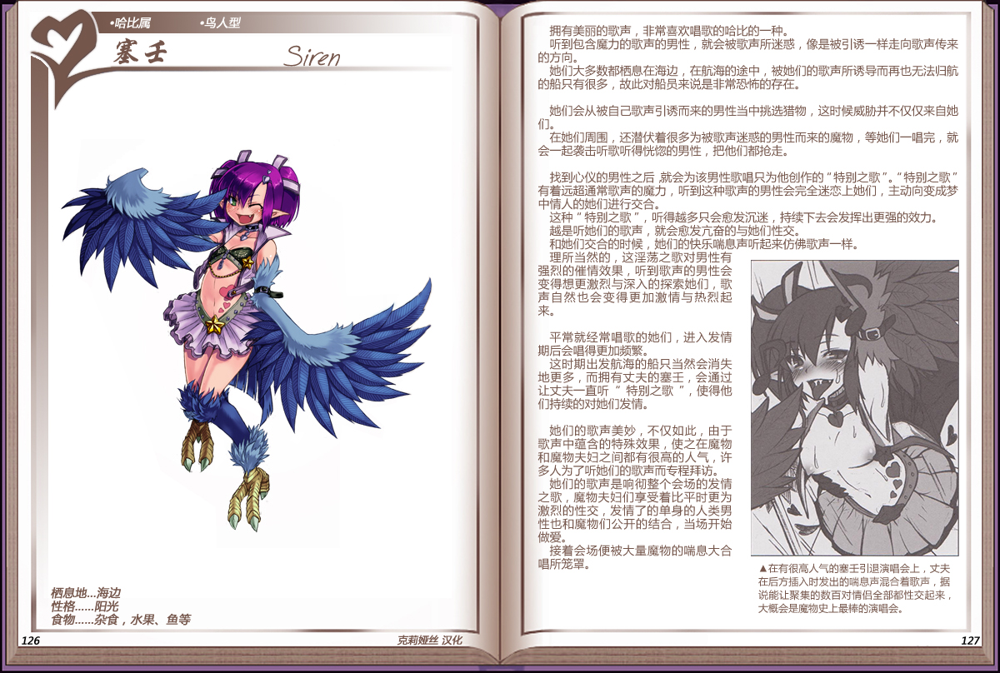

# 塞壬

|名称|塞壬|
|:-:|:-:|
|种属|哈比种|
|类型|鸟人型|
|栖息地|海边|
|性格|阳光|
|食物|杂食，水果、鱼等|

拥有美丽的歌声，非常喜欢唱歌的哈比的一种。

听到包含魔力的歌声的男性，就会被歌声所迷惑，像是被引诱一样走向歌声传来的方向。

她们大多数都栖息在海边，在航海的途中，被她们的歌声所诱导而再也无法归航的船只有很多，故此对船员来说是非常恐怖的存在。

 

她们会从被自己歌声引诱而来的男性当中挑选猎物，这时候威胁并不仅仅来自她们。

在她们周围，还潜伏着很多为被歌声迷惑的男性而来的魔物，等她们一唱完，就会一起袭击听歌听得恍憋的男性，把他们都抢走。

 

找到心仪的男性之后就会为该男性歌唱只为他创作的“特别之歌”。“特别之歌”有着远超通常歌声的魔力，听到这种歌声的男性会完全迷恋上她们，主动向变成梦中情人的她们进行交合。

这种“特别之歌”，听得越多只会愈发沉迷，持续下去会发挥出更强的效力。

越是听她们的歌声，就会愈发亢奋的与她们性交。

和她们交合的时候，她们的快乐喘息声听起来仿佛歌声一样。

理所当然的，这淫荡之歌对男性有强烈的催情效果，听到歌声的男性会变得想更激烈与深入的探索她们，歌声自然也会变得更加激情与热烈起来。

 

平常就经常唱歌的她们，进入发情期后会唱得更加频繁。

这时期出发航海的船只当然会消失地更多，而拥有丈夫的塞壬，会通过让丈夫一直听”特别之歌”，使得他们持续的对她们发情。

 

她们的歌声美妙，不仅如此，由于歌声中蕴含的特殊效果，使之在魔物和魔物夫妇之间都有很高的人气，许多人为了听她们的歌声而专程拜访。

她们的歌声是响彻整个会场的发情之歌，魔物夫妇们享受着比平时更为激烈的性交，发情了的单身的人类男性也和魔物们公开的结合，当场开始做爱。

接着会场便被大量魔物的喘息大合唱所笼罩。

---

附图： 

