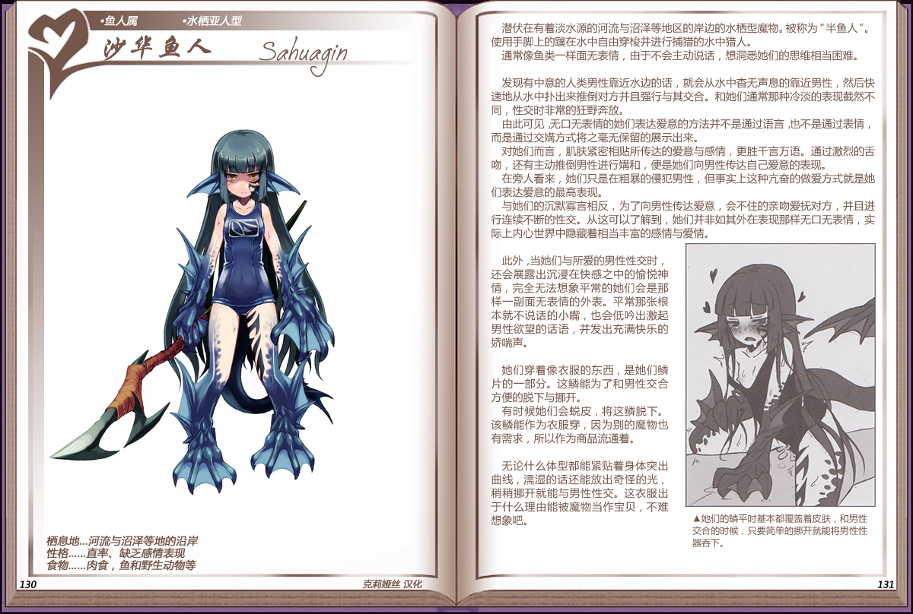

# 沙华鱼人

|名称|沙华鱼人|
|:-:|:-:|
|种属|鱼人属|
|类型|水栖亚人型|
|栖息地|河流与沼泽等地的沿岸|
|性格|直率、缺乏感情表现|
|食物|肉食，鱼和野生动物等|

潜伏在有着淡水源的河流与沼泽等地区的岸边的水栖型魔物。被称为“半鱼人”。使用手脚上的蹼在水中自由穿梭并进行捕猎的水中猎人。

通常像鱼类一样面无表情，由于不会主动说话，想洞悉她们的思维相当困难。

 

发现有中意的人类男性靠近水边的适，就会从水中查无声息的靠近男性，然后快速地从水中扑出来推倒对方并且强行与其交合。和她们门通常那种冷淡的表现截然不同，性交时非常的狂野奔放。

由此可见无口无表情的她们表达爱意的方法并不是通过语言也不是通过表情而是通过交螨方式将之毫无保留的展示出来。

对她们而言，肌肤紧密相贴所传达的爱意与感情，更胜干言万语。通过激烈的舌吻，还有主动推倒男性进行購和，便是她们向男性传达自己爱意的表现。

在旁人看来，她们只是在粗暴的侵犯男性，但事实上这种亢奋的做爱方式就是她们表达爱意的最高表现

与她们的沉默寡言相反，为了向男性传达爱意，会不住的亲吻爱抚对方，并且进行连续不断的性交。从这可以了解到，她们并非如其外在表现那样无口无表情，实际上内心世界中隐藏着相当丰富的感情与爱情。

 

此外，当她们与所爱的男性性交时还会展露出沉浸在快感之中的愉悦神情，完全无法想象平常的她们会是那样一副面无表情的外表。平常那张根本就不说话的小嘴，也会低吟出激起男性欲望的话语，并发出充满快乐的娇喘声。

 

她们穿着像衣服的东西，是她们鳞片的一部分。这鳞能为了和男性交合方便的脱下与挪开。

有时候她们会蜕皮，将这鳞脱下。该鳞能作为衣服穿，因为别的魔物也有需求，所以作为商品流通着。

 

无论什么体型都能紧贴着身体突出曲线，湿的话还能放出奇怪的光，稍稍挪开就能与男性性交。这衣服出于什么理由能被魔物当作宝贝，不难想象吧。

---

附图： 