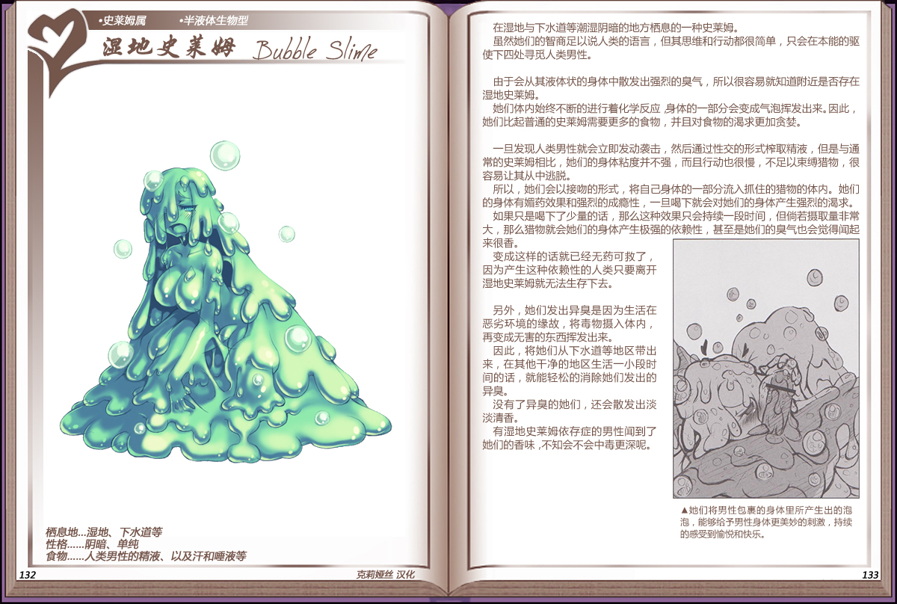

# 湿地史莱姆

|名称|湿地史莱姆|
|:-:|:-:|
|种属|史莱姆属|
|类型|半液体生物型|
|栖息地|湿地、下水道等|
|性格|阴暗、单纯|
|食物|人类男性的精液、以及汗和睡液等|

在湿地与下水道等潮湿阴暗的地方栖心的一种史莱姆。

虽然她们的智商足以说人类的语言，但其思维和行动都很简单，只会在本能的驱使下四处寻觅人类男性。

 

由于会从其液体状的身体中散发出强烈的臭气，所以很容易就知道附近是否存在湿地史莱姆。

她们体内始终不断的进行着化学反应身体的一部分会变成气泡挥发出来。因此，她们比起普通的史莱姆需要更多的食物，并且对食物的渴求更加贪婪。

 

旦发现人类男性就会立即发动袭击，然后通过性交的形式榨取精液，但是与通常的史莱姆相比，她们的身体粘度并不强，而且行动也很慢，不足以束缚猎物，很容易让其从中逃脱。

所以，她们会以接吻的形式，将自己身体的一部分流入抓住的猎物的体内。她们的身体有媚药效果和强烈的成瘾性，一旦喝下就会对她们的身体产生强烈的渴求。如果只是喝下了少量的话，那么这种效果只会持续一段时间，但倘若摄取量非常大，那么猎物就会她们的身体产生极强的依赖性，甚至是她们的臭气也会觉得闻起来很香。

变成这样的话就已经无药可救了因为产生这种依赖性的人类只要离开湿地史莱姆就无法生存下去。

 

另外，她们发出异臭是因为生活在恶劣环境的缘故，将毒物摄入体内，再变成无害的东西挥发出来。

因此，将她们从下水道等地区带出来，在其他干净的地区生活一小段时间的话，就能轻松的消除她们发出的异臭。

没有了异臭的她们，还会散发出淡淡清香。

有湿地史莱姆依存症的男性闻到了她们的香味，不知会不会中毒更深呢。

---

附图： 
