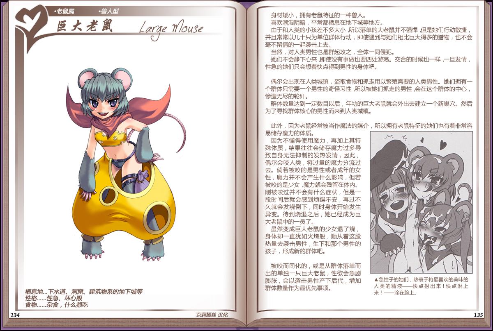

# 巨大老鼠

|名称|巨大老鼠|
|:-:|:-:|
|种属|老鼠属|
|类型|兽人型|
|栖息地|下水道、洞窟、建筑物系的地下城等|
|性格|性急、坏心眼|
|食物|杂食，什么都吃|

身材矮小，拥有老鼠特征的一种兽人。

喜欢潮湿阴暗，平常都栖息在地下城等地方。

由于和人类的小孩差不多大小所以落单的大老鼠并不强悍，但是她们行动敏捷并且常常以几十只为单位群体行动，即使遇到与她们相比巨大得多的猎物，也不会毫不留情的一起袭击上去。

当然，对人类男性也是群起攻之，全体一同侵犯。

她们不会静下心来，即使没有事做也要四处游荡。交合的时候也一样，一旦发情，性急的她们只会想着快点得到男性的身体吧。

 

偶尔会出现在人类城镇，盗取食物和抓走用以繁殖需要的人类男性。她们拥有一个群体只需要一个男性的奇怪习性，所以被她们抓走的男性，会在这个群体的中心，惨遭无尽的轮奸。

群体数量达到一定数目以后，年幼的巨大老鼠就会外出去建立一个新巢穴。然后为了寻找群体核心的男性而来到人类城镇。

 

此外，因为老鼠经常被当作魔法的媒介，所以拥有老鼠特征的她们也有着非常容易储存魔力的体质。

因为不懂得使用魔力，再加上其特殊体质，结果往往会储存魔力过多导致自身无法抑制的发热发情，因此，偶尔会咬人类，将过量的魔力分流过去。倘若被咬的是男性或者成年的女性，魔力并不会产生什么影响，但若被咬的是少女，魔力就会残留在体内。刚被咬过并不会有什么症状，但是一段时间后就会感到烦躁不安，再过不久就会发烧倒下，同时身体开始发生异变。待到烧退之后，她已经成为巨大老鼠中的一员了。

虽然变成巨大老鼠的少女退了烧，身体却一直犹如火烤般，顺从着这股热量去袭击男性，生下和那个男性的孩子，形成新的群体吧。

 

被咬而同化的，或是从群体落单而出的单独一只巨大老鼠，性欲会急剧膨胀，会以袭击男性产下后代，增加群体数量作为最优先事项。

---

附图： 