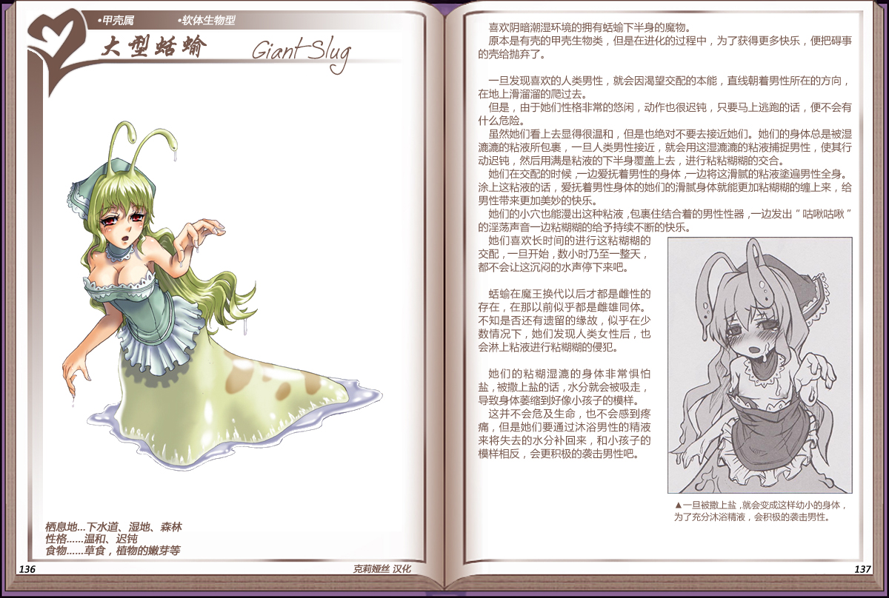

# 大型蛞蝓

|名称|大型蛞蝓|
|:-:|:-:|
|种属|甲壳属|
|类型|软体生物型|
|栖息地|下水道、湿地、森林|
|性格|温和、迟钝|
|食物|草食，植物的嫩芽等|

喜欢阴暗潮湿环境的拥有输下半身的魔物。

原本是有壳的甲壳生物类，但是在进化的过程中，为了获得更多快乐，便把碍事的壳给抛弃了。

 

旦发现喜欢的人类男性，就会因渴望交配的本能，直线朝着男性所在的方向，在地上滑溜溜的爬过去。

但是，由于她们性格非常的悠闲，动作也很迟钝，只要马上逃跑的话，便不会有什么危险。

虽然她们着上去显得很温和，但是也绝对不要去接近她们。她们的身体总是被湿滬滬的粘液所包裹，一旦人类男性接近，就会用这湿滬滬的粘液捕捉男性，使其行动迟钝，然后用满是粘液的下半身覆盖上去，进行粘粘糊糊的交合。

她们在交配的时候，一边爱抚着男性的身体，一边将这滑腻的粘液遍男性全身。涂上这粘液的话，爱抚着男性身体的她们的滑腻身体就能更加粘糊糊的缠上来，给男性带来更加美妙的快乐。

她们的小穴也能漫出这种粘液，包裹住结合着的男性性器，一边发出“咕啾咕啾”的淫荡声音一边粘糊糊的给予持续不断的快乐。

她们喜欢长时间的进行这粘糊糊的交配，一旦开始，数小时乃至一整天，都不会让这沉闷的水声停下来吧。

 

蛞蝓在魔王换代以后才都是雌性的存在，在那以前似乎都是雌雄同体。不知是否还有遗留的缘故，似乎在少数情况下，她们发现人类女性后，也会淋上粘液进行粘糊糊的侵犯。

 

她们的粘糊湿滬的身体非常惧怕盐，被撒上盐的话，水分就会被吸走，导致身体萎缩到好像小孩子的模样。

这并不会危及生命，也不会感到疼痛，但是她们要通过沐浴男性的精液来将失去的水分补回来，和小孩子的模样相反，会更积极的袭击男性吧。

---

附图： 