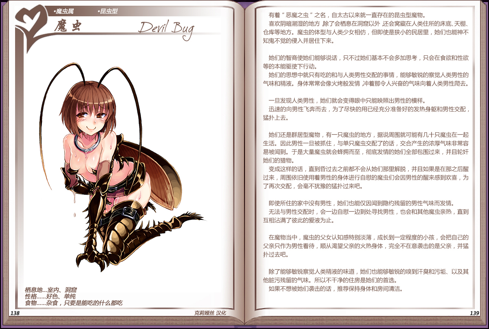
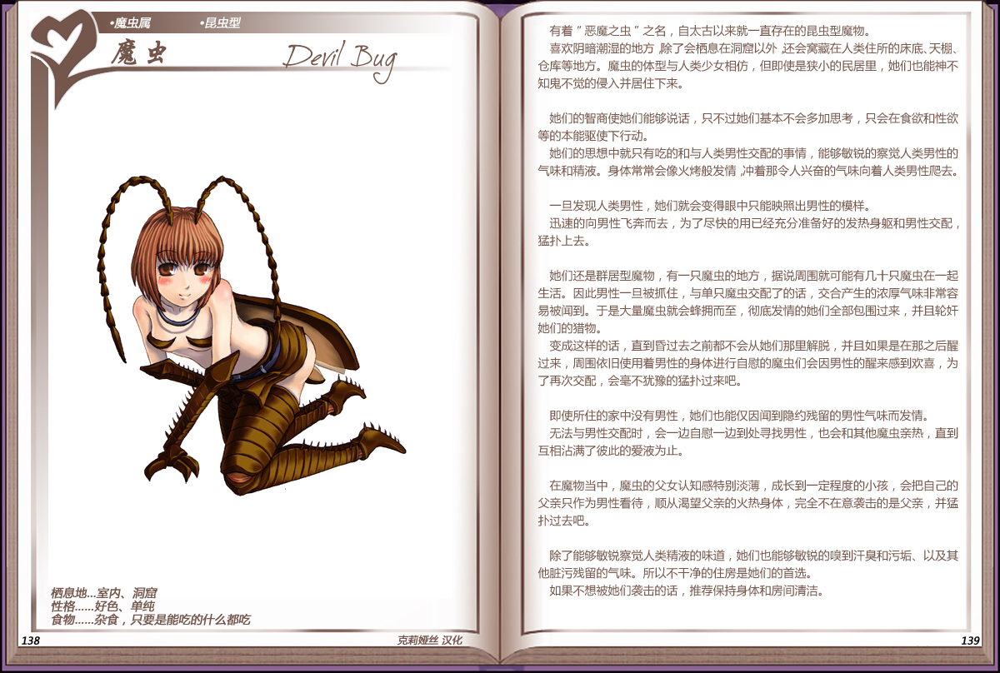

# 魔虫

|名称|魔虫|
|:-:|:-:|
|种属|魔虫属|
|类型|昆虫型|
|栖息地|室内、洞窟|
|性格|好色、单纯|
|食物|杂食，只要是能吃的什么都吃|

有着恶魔之虫之名，自太古以来就一直存在的昆虫型魔物。

喜欢阴暗潮湿的地方除了会栖息在洞窟以外还会窝藏在人类住所的床底、天棚、仓库等地方。魔虫的体型与人类少女相仿，但即使是狭小的民居里，她们也能神不知鬼不觉的侵入并居住下来。

 

她们的智商使她们能够说话，只不过她们基本不会多加思考，只会在食欲和性欲等的本能驱使下行动。

她们的思想中就只有吃的和与人类男性交配的事情，能够敏锐的察觉人类男性的气味和精液。身体常常会像火烤般发情，冲着那令人兴奋的气味向着人类男性爬去。

 

一旦发现人类男性，她们就会变得眼中只能映照出男性的模样。

迅速的向男性飞奔而去，为了尽快的用已经充分准备好的发热身躯和男性交配，猛扑上去。

 

她们还是群居型魔物，有一只魔虫的地方，据说周围就可能有几十只魔虫在一起生活。因此男性一旦被抓住，与单只魔虫交配了的话，交合产生的浓厚气味非常容易被闻到。于是大量魔虫就会蜂拥而至，彻底发情的她们全部包围过来，并且轮奸她们的猎物。

变成这样的话，直到昏过去之前都不会从她们那里解脱，并且如果是在那之后醒过来，周围依旧使用着男性的身体进行自慰的魔虫们会因男性的醒来感到欢喜，为了再次交配，会毫不犹豫的猛扑过来吧。

 

即使所住的家中没有男性，她们也能仅因闻到隐约残留的男性气味而发情。

无法与男性交配时，会一边自慰一边到处寻找男性，也会和其他魔虫亲热，直到互相沾满了彼此的爱液为止。

 

在魔物当中，魔虫的父女认知感特别淡薄，成长到一定程度的小孩，会把自己的父亲只作为男性看待，顺从渴望父亲的火热身体，完全不在意袭击的是父亲，并猛扑过去吧。

 

除了能够敏锐察觉人类精液的味道，她们也能够敏锐的嘎到汗臭和污垢、以及其他脏污残留的气味。所以不干净的住房是她们的首选。

如果不想被她们袭击的话，推荐保持身体和房间清洁。

---

附图： 

旧版： 