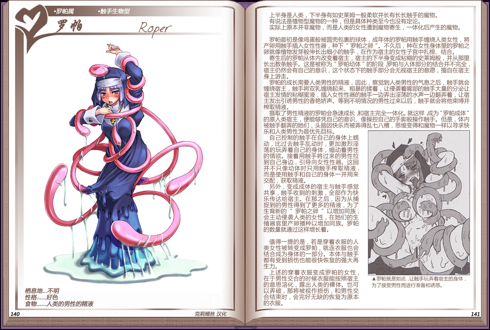

# 罗帕

|名称|罗帕|
|:-:|:-:|
|种属|罗帕属|
|类型|触手生物型|
|栖息地|不明|
|性格|好色|
|食物|人类的男性的元精|

上半身是人类，下半身有如史莱姆一般柔软并长有长长触手的魔物。

有说法是植物型魔物的一种，但是具体种类至今也没有定论。

实际上原本并非魔物，而是人类的女性遭到魔物寄生，一体化后产生的魔物。

 

罗帕最初是像鸡蛋般被圆壳包裹的球体，成年体的罗拍用触手缠绕人类女性，将产卵用触手插入女性性器，种下“罗帕之卵”。不久后，种在女性身体里的罗帕之卵就像植物发芽般伸长出细小的触手，在作为宿主的女性子宫中扎根、结合。

奇生后的罗帕从体内改变着宿主，宿主的下半身变成粘糊的史莱姆般，并从那里长出数条触手。这是被称为”罗帕幼体”的阶段罗帕与人体部分的结合并不完全宿主仍然会有自己的意识，这个状态下的触手部分会无视宿主的意愿，擅自在宿主身上游走。

罗帕的成长需要人类男性的精液，因此，察觉到人类男性的气息之后，触手就会缠绕宿主，触手将双乳缠绕起来、粗暴的揉着，让侵袭着嘴部的触手大量的分泌让宿主发情的粘糊蜜液，插入女性性器的触手一边弄出淫荡的水声一边翻弄着，让宿主发出引诱男性的香艳娇声。等到不明情况的男性过来以后，触手就会将他束缚并榨取精液。

摄取了男性精液的罗帕会急速成长和宿主完全一体化。就这样成为”罗帕成体” 的原人类宿主，便能够凭自已的意识、像操控自已的手脚般操作触手。但是，体内被触手翻弄的她们，头脑因快乐而被弄得乱七八糟，思维变得和魔物一样以寻求快乐和人类男性为最优先目标。

自己控制的触手在自己的身体上蜡动，比过去触手乱动时，更加激烈淫荡的玩弄着自己的身体，煽动着男性的情欲。接着用触手将过来的男性拉到自已身边，引导向女性性器。这回并不只像幼体时只用触手榨取精液而是使用触手和自己的身体一并用来交配，获取精液。

另外，变成成体的宿主与触手感觉共享，触手收到的刺激，全部作为快乐传达给宿主。在那之后，因为从捕捉到的男性得到了更多的精液，为了生育新的罗帕之卵，以增加同族，会主动侵袭人类的女性，在她们的生殖器官里产卵播种以增加同族。罗帕的数量就通过这样增长着。

 

值得一提的是，若是穿着衣服的人类女性被转变成罗帕，就连衣服也会结合成为身体的一部分。本体与触手都有受到损伤也能很快恢复的强大再生力。

上述的穿着衣服变成罗拍的女性在于男性交合的时候衣服能按照宿主的意思溶化，露出人类的裸体。也可以弄破，那将被视作损伤，和男性交合结束时，会完好无缺的恢复为原本的衣服。

---

附图： 