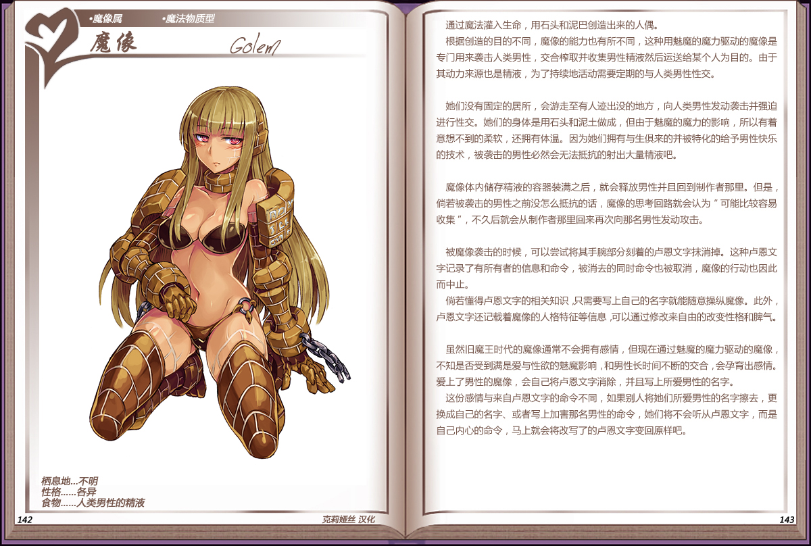
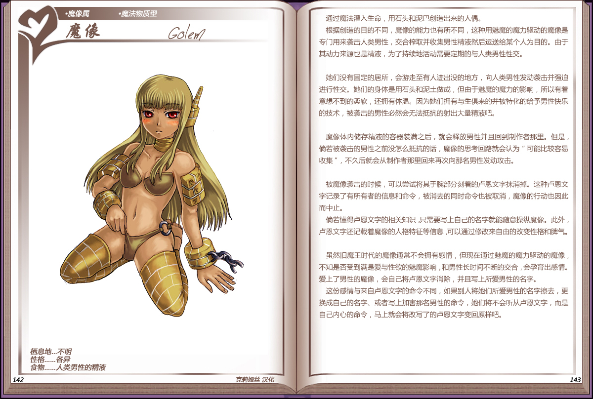

# 魔像

|名称|魔像|
|:-:|:-:|
|种属|魔像属|
|类型|魔法物质型|
|栖息地|不明|
|性格|各异|
|食物|人类男性的元精|

通过魔法灌入生命，用石头和泥巴创造出来的人偶。

根据创造的目的不同，魔像的能力也有所不同，这种用魅魔的魔力驱动的魔像是专门用来袭击人类男性，交合榨取并收集男性精液然后运送给某个人为目的。由于其动力来源也是精液，为了持续地活动需要定期的与人类男性性交。

 

她们没有固定的居所，会游走至有人迹出没的地方，向人类男性发动袭未并强迫进行性交。她们的身体是用石头和泥土做成，但由于魅魔的魔力的影响，所以有着意想不到的柔软，还拥有体温。因为她们拥有与生俱来的并被特化的给予男性快乐的技术，被袭击的男性必然会无法抵抗的射出大量精液吧。

 

魔像体内储存精液的容器装满之后，就会释放男性并且回到制作者那里。但是，尚若被袭击的男性之前没怎么抵抗的话，魔像的思考回路就会认为“可能比较容易收集”，不久后就会从制作者那里回来再次向那名男性发动攻击。

 

被魔像袭击的时候，可以尝试将其手腕部分刻着的卢恩文字抹消掉。这种卢恩文字记录了有所有者的信息和命令，被消去的同时命令也被取消，魔像的行动也因此而中止。

尚若懂得卢恩文字的相关知识，只需要写上自己的名字就能随意操纵魔像。此外，卢恩文字还记载着魔像的人格特征等信息，可以通过修改来自由的改变性格和脾气。

 

虽然旧魔王时代的魔像通常不会拥有感情，但现在通过魅魔的魔力驱动的魔像，不知是否受到满是爱与性欲的魅魔影响，和男性长时间不断的交合，会孕育出感情。爱上了男性的魔像，会自己将卢恩文字消除，并且写上所爱男性的名字。

这份感情与来自卢恩文字的命令不同，如果别人将她们所爱男性的名字擦去，更换成自己的名字、或者写上加害那名男性的命令，她们将不会听从卢恩文字，而是自己内心的命令，马上就会将改写了的卢恩文字变回原样吧。

---

附图： 

旧版： 