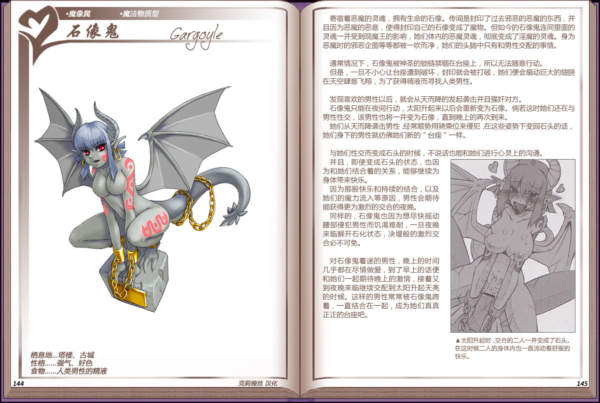

# 石像鬼

|名称|石像鬼|
|:-:|:-:|
|种属|魔像属|
|类型|魔法物质型|
|栖息地|塔楼、古城|
|性格|强气、好色|
|食物|人类男性的元精|

寄宿着恶魔的灵魂，拥有生命的石像。传闻是封印了过去邪恶的恶魔的东西，并且因为恶魔的恶意，使得封印自己的石像变成了魔物。但如今的石像鬼连同里面的灵魂一并受到现魔王的影响，她们体内的恶魔灵魂，彻底变成了淫魔的灵魂。身为恶魔时的邪恶企图等等都被一吹而净，她们的头脑中只有和男性交配的事情。

 

通常情况下，石像鬼被神圣的锁链禁铟在台座上，所以无法随意行动。

但是，一旦不小心让台座遭到破坏，封印就会被打破，她们便会扇动巨大的翅膀在天空肆意飞翔，为了获得精液而寻找人类男性。

 

发现喜欢的男性以后，就会从天而降的发起袭击并且强奸对方。

石像鬼只能在夜间行动，太阳升起来以后会重新变为石像。尚若这时她们还在与男性性交，该男性也将一并变为石像，直到晚上的再次到来。

她们从天而降袭击男性经常顺势用骑乘位来侵犯在这些姿势下变回石头的话，她们身下的男性就仿佛她们新的“台座”一样。

 

与她们性交而变成石头的时候，不说话也能和她们进行心灵上的沟通。

并且，即使变成石头的状态，也因为和她们结合着的关系，能够继续为身体带来快乐。

因为那股快乐和持续的结合，以及她们的魔力流入等原因，男性会期待能获得更为激烈的交合的夜晚。

同样的，石像鬼也因为想尽快摇动腰部侵犯男性而饥渴难耐，一旦夜晚来临解开石化状态，决堤般的激烈交合必不可免。

 

对石像鬼着迷的男性，晚上的时间几乎都在尽情做爱，到了早上的话便和她们一起期待晚上的激情，接着又到夜晚来临继续交配到太阳升起天亮的时候。这样的男性常常被石像鬼跨着，一直结合在一起，成为她们真真正正的台座吧。

---

附图： 