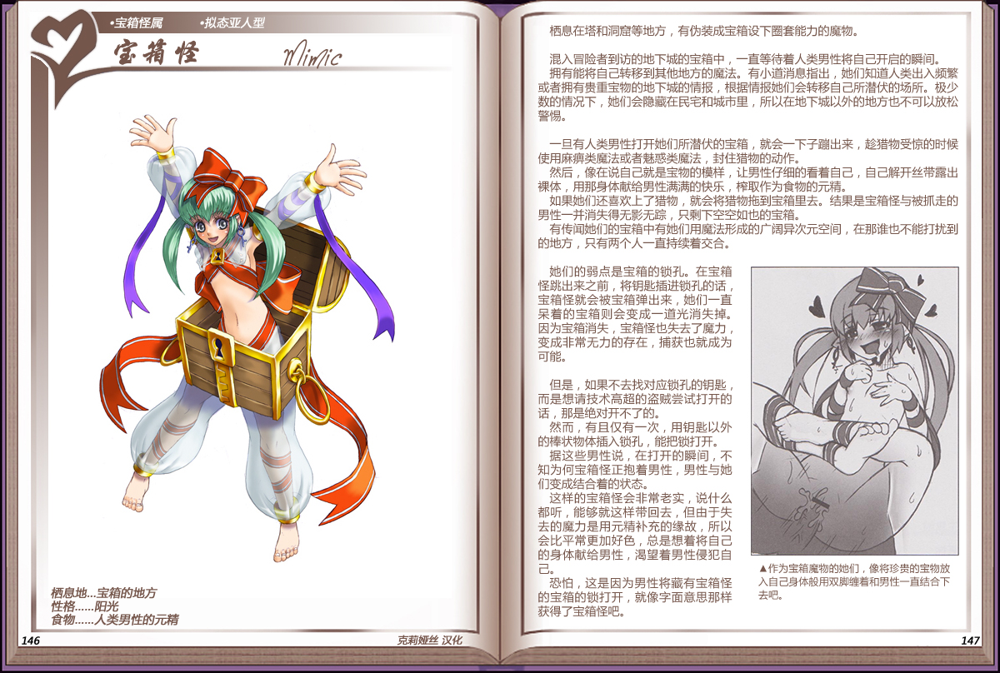

# 宝箱怪

|名称|宝箱怪|
|:-:|:-:|
|种属|宝箱怪属|
|类型|拟态亚人型|
|栖息地|宝箱的地方|
|性格|阳光|
|食物|人类男性的元精|

栖息在塔和洞等地方，有伪装成宝箱设下套能力的魔物。

 

混入冒险者到访的地下城的宝箱中，一直等待着人类男性将自己开启的瞬间。

拥有能将自己转移到其他地方的魔法。有小道消息指出，她们知道人类出入频繁或者拥有贵重宝物的地下城的情报，根据情报她们会转移自己所潜伏的场所。极少数的情况下，她们会隐藏在民宅和城市里，所以在地下城以外的地方也不可以放松警惕。

 

一旦有人类男性打开她们所潜伏的宝箱，就会一下子蹦出来，趁猎物受惊的时候使用麻痹类魔法或者魅惑类魔法，封住猎物的动作。

然后，像在说自己就是宝物的模样，让男性仔细的看着自己，自己解开丝带露出裸体，用那身体献给男性满满的快乐，榨取作为食物的元精。

如果她们还喜欢上了猎物，就会将猎物拖到宝箱里去。结果是宝箱怪与被抓走的男性一并消失得无影无踪，只剩下空空如也的宝箱。
有传闻她们的宝箱中有她们用魔法形成的广阔异次元空间，在那谁也不能打扰到的地方，只有两个人一直持续着交合。

 

她们的弱点是宝箱的锁孔。在宝箱怪跳出来之前，将钥匙插进锁孔的话宝箱怪就会被宝箱弹出来，她们一直呆着的宝箱则会变成一道光消失掉。因为宝箱消失，宝箱怪也失去了魔力变成非常无力的存在，捕获也就成为可能。

 

但是，如果不去找对应锁孔的钥匙而是想请技术高超的盗贼尝试打开的话，那是绝对开不了的。

然而，有且仅有一次，用钥匙以外的棒状物体插入锁孔，能把锁打开。据这些男性说，在打开的瞬间，不知为何宝箱怪正抱着男性，男性与她们变成结合着的状态。

这样的宝箱怪会非常老实，说什么都听，能够就这样带回去，但由于失去的魔力是用元精补充的缘故，所以会比平常更加好色，总是想着将自己的身体献给男性，渴望着男性侵犯自己。

恐怕，这是因为男性将藏有宝箱怪的宝箱的锁打开，就像字面意思那样获得了宝箱怪吧。

---

附图： 