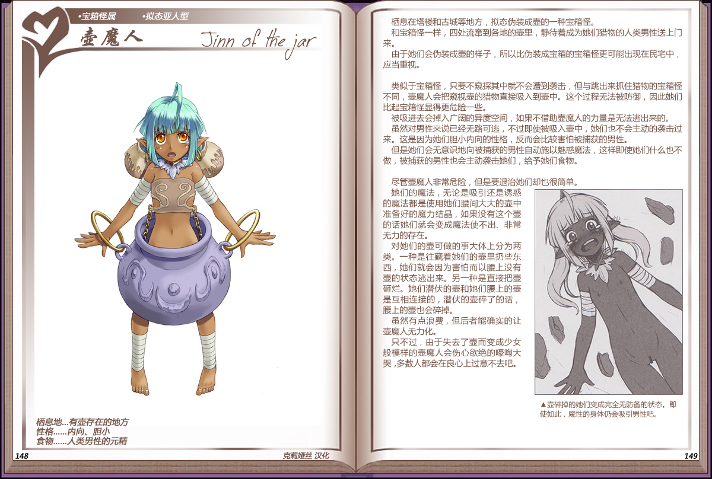

# 壶魔人

|名称|壶魔人|
|:-:|:-:|
|种属|宝箱怪属|
|类型|拟态亚人型|
|栖息地|有壶存在的地方|
|性格|内向、胆小|
|食物|人类男性的元精|

栖息在塔楼和古城等地方，拟态伪装成壶的一种宝箱怪。

和宝箱怪一样，四处流窜到各地的壶里，静待着成为她们猎物的人类男性送上门来。

由于她们会伪装成壶的样子，所以比伪装成宝箱的宝箱怪更可能出现在民宅中，应当重视。

 

类似于宝箱怪，只要不窥探其中就不会遭到袭击，但与跳出来抓住猎物的宝箱怪不同，壶魔人会把窥视壶的猎物直接吸入到壶中。这个过程无法被防御，因此她们比起宝箱怪显得更危险一些.

被吸进去会掉入广阔的异度空间，如果不借助壶魔人的力量是无法逃出来的。

虽然对男性来说已经无路可逃，不过即使被吸入壶中，她们也不会主动的袭击过来。这是因为她们胆小内向的性格，反而会比较害怕被捕获的男性。

但是她们会无意识地向被捕获的男性自动施以魅惑魔法，这样即使她们什么也不做，被捕获的男性也会主动袭击她们，给予她们食物。

 

尽管壶魔人非常危险，但是要退治她们却也很简单。

她们的魔法，无论是吸引还是诱惑的魔法都是使用她们腰间大大的壶中准备好的魔力结晶，如果没有这个壶的话她们就会变成魔法使不出、非常无力的存在。

对她们的壶可做的事大体上分为两类。一种是往藏着她们的壶里扔些东西，她们就会因为害怕而以腰上没有壶的状态逃出来。另一种是直接把壶砸烂。她们潜伏的壶和她们腰上的壶是互相连接的，潜伏的壶碎了的话，腰上的壶也会碎掉。

虽然有点浪费，但后者能确实的让壶魔人无力化。

只不过，由于失去了壶而变成少女般模样的壶魔人会伤心欲绝的濠陶大哭，多数人都会在良心上过意不去吧。

---

附图： 