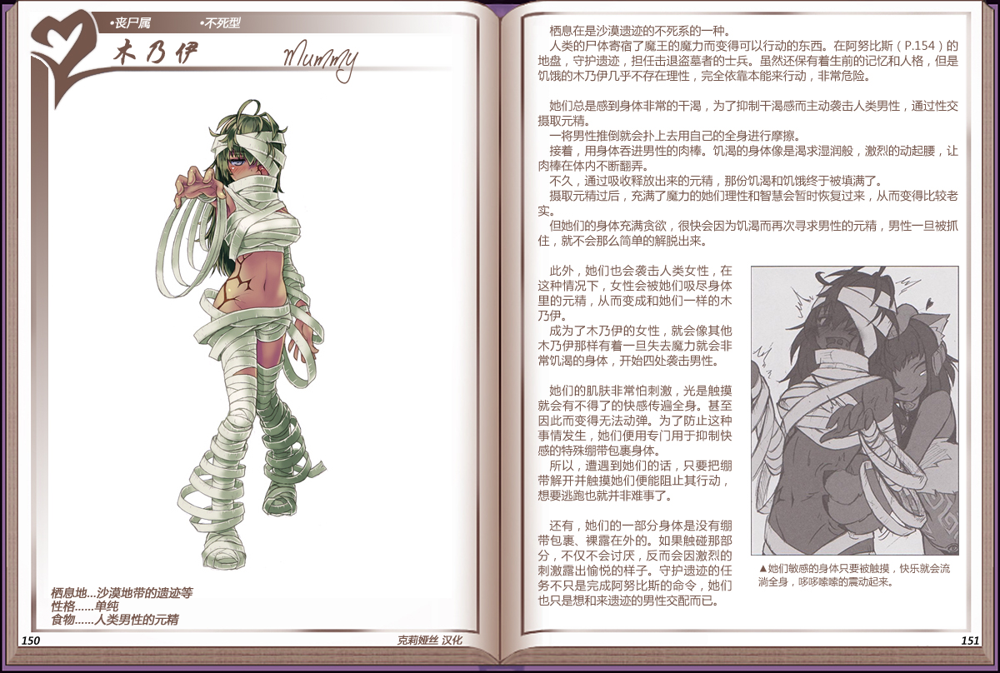

# 木乃伊

|名称|木乃伊|
|:-:|:-:|
|种属|丧尸属|
|类型|不死型|
|栖息地|沙漠地带的遗迹|
|性格|单纯|
|食物|人类男性的元精|

栖息在是沙漠遗迹的不死系的一种。

人类的尸体寄宿了魔王的魔力而变得可以行动的东西。在[阿努比斯](69阿努比斯.md)的地盘，守护遗迹，担任击退盗墓者的士兵。虽然还保有着生前的记忆和人格，但是饥饿的木乃伊几乎不存在理性，完全依靠本能来行动，非常危险。

 

她们总是感到身体非常的于渴，为了抑制于渴感而主动袭击人类男性，通过性交摄取元精。

一将男性推倒就会扑上去用自己的全身进行摩擦。

接着，用身体吞进男性的肉棒。饥渴的身体像是渴求湿润般，激烈的动起腰，让肉棒在体内不断翻弄。

不久，通过吸收释放出来的元精，那份饥渴和饥饿终于被填满了。

摄取元精过后，充满了魔力的她们理性和智慧会暂时恢复过来，从而变得比较老实。

但她们的身体充满贪欲，很快会因为饥渴而再次寻求男性的元精，男性一旦被抓住，就不会那么简单的解脱出来。

 

此外，她们也会袭击人类女性，在这种情况下，女性会被她们吸尽身体里的元精，从而变成和她们一样的木乃伊。

成为了木乃伊的女性，就会像其他木乃伊那样有着一旦失去魔力就会非常饥渴的身体，开始四处袭击男性。

 

她们的肌肤非常怕刺激，光是触摸就会有不得了的快感传遍全身。甚至因此而变得无法动弹。为了防止这种事情发生，她们便用专门用于抑制快感的特殊绷带包裹身体。

所以，遭遇到她们的话，只要把绷带解开并触摸她们便能阻止其行动，想要逃跑也就并非难事了。

 

还有，她们的一部分身体是没有绷带包裹、裸露在外的。如果触碰那部分，不仅不会讨厌，反而会因激烈的刺激露出愉悦的样子。守护遗迹的任务不只是完成阿努比斯的命令，她们也只是想和来遗迹的男性交配而已。

---

附图： 