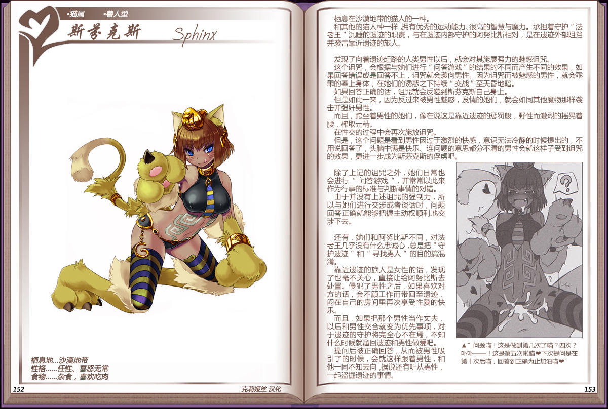

# 斯芬克斯

|名称|斯芬克斯|
|:-:|:-:|
|种属|猫属|
|类型|兽人型|
|栖息地|沙漠地带|
|性格|任性、喜怒无常|
|食物|杂食，喜欢吃肉|

栖息在沙漠地带的猫人的一种。

和其他的猫人种一样拥有优秀的运动能力、很高的智慧与魔力。承担着守护”法老王”沉睡的遗迹的职责，与在遗迹内部守护的阿努比斯相对，是在遗迹外部阻挡并袭击靠近遗迹的旅人。

 

发现了向着遗迹赶路的人类男性以后，就会对其施展强力的魅惑咒。

这个诅咒，会根据与她们进行“问答游戏”的结果的不同而产生不同的效果，如果回答错误或是回答不上，诅咒就会袭向男性。因为诅咒而被魅惑的男性，就会乖

乖的奉上身体，在她们的诱惑之下持续“交战”至天昏地暗。如果回答正确的话，诅咒就会反噬到斯芬克斯自己身上。

但是如此一来，因为反过来被男性魅惑，发情的她们，就会如同其他魔物那样袭击并强奸男性。

而且，跨坐着男性的她们，像在说这是靠近遗迹的惩罚般，野性而激烈的摇晃着腰，榨取元精。

在性交的过程中会再次施放咒。

但是，这个问题是看到男性因过于激烈的快感，意识无法冷静的时候提出的，不用说回答了，头脑中满是快乐、连问题的意思都分不清的男性会就这样子受到咒的效果，更进一步成为斯芬克斯的俘虏吧。

 

除了上记的诅咒之外，她们日常也会进行“问答游戏“，并常常以此来作为行事的标准与判断事情的对错。

由于并没有上述诅咒的强制力，所以与她们进行交涉或者谈话时，问题回答正确就能够把握主动权顺利地交涉下去。

 

还有，她们和阿努比斯不同，对法老主乎没有什么患忠诚心，总是把“守护遗迹“和”寻找男人”的目的搞混淆。

靠近遗迹的旅人是女性的话，发现了也毫不关心，直接让给阿努比斯去处置。侵犯了男性之后，如果喜欢对方的话，会不顾工作而带回至遗迹，闷在自己的房间里再次享受性爱的快乐。

而且，如果把那个男性当作丈夫，以后和男性交合就变为优先事项，对于遗迹的守护将完全心不在焉，不知什么时候就溜回遗迹和男性做爱吧。

提问后被正确回答，从而被男性吸引了的时候，会就这样跟着男性，和他一同不知去向，据说还有听从男性，一起盗掘遗迹的事情。

---

附图： 