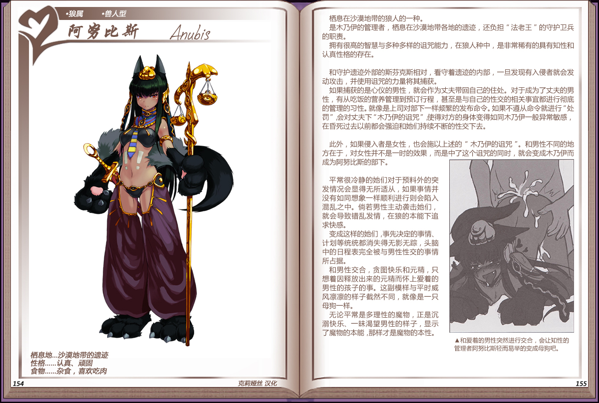

# 阿努比斯

|名称|阿努比斯|
|:-:|:-:|
|种属|狼属|
|类型|兽人型|
|栖息地|沙漠地带的遗迹|
|性格|认真、顽固|
|食物|杂食，喜欢吃肉|

栖息在沙漠地带的狼人的一种。

是木乃伊的管理者，栖息在沙漠地带各地的遗迹，还负担“法老王”的守护卫兵的职责。

拥有很高的智慧与多种多样的咒能力，在狼人种中，是非常稀有的具有知性和认真性格的存在。

 

和守护遗迹外部的斯芬克斯相对，看守着遗迹的内部，一旦发现有入侵者就会发动攻击，并使用诅咒的力量将其捕获。

如果捕获的是心仪的男性，就会作为丈夫带回自己的住处。对于成为了丈夫的男性，有从吃饭的营养管理到预订行程，甚至是与自己的性交的相关事宜都进行彻底的管理的习性。就像是上司对部下一样频繁的发布命令。如果不遵从命令就进行“处罚”会对丈夫下“木乃伊的诅咒”使得对方的身体变得如同木乃伊一般异常敏感，在昏死过去以前都会强迫和她们持续不断的性交下去。

 

此外，如果侵入者是女性，也会施以上述的“木乃伊的诅咒”。和男性不同的地方在于，对女性并不是一时的效果，而是中了这个诅咒的同时，就会变成木乃伊而成为阿努比斯的部下。

 

平常很冷静的她们对于预料外的突发情况会显得无所适从，如果事情并没有如同想象一样顺利进行则会陷入混乱之中。尚若男性主动袭击她们就会导致错乱发情，在狼的本能下追求快感。

变成这样的她们，事先决定的事情计划等统统都消失得无影无踪，头脑中的日程表完全被与男性性交的事情所占据。

和男性交合，贪图快乐和元精，只想着因释放出来的元精而怀上爱着的男性的孩子的事。这副模样与平时威风凛凛的样子截然不同，就像是一只母狗一样。

无论平常是多理性的魔物，正是沉溺快乐、一味渴望男性的样子，显示了魔物的本能，那样才是魔物的本性。

---

附图： 