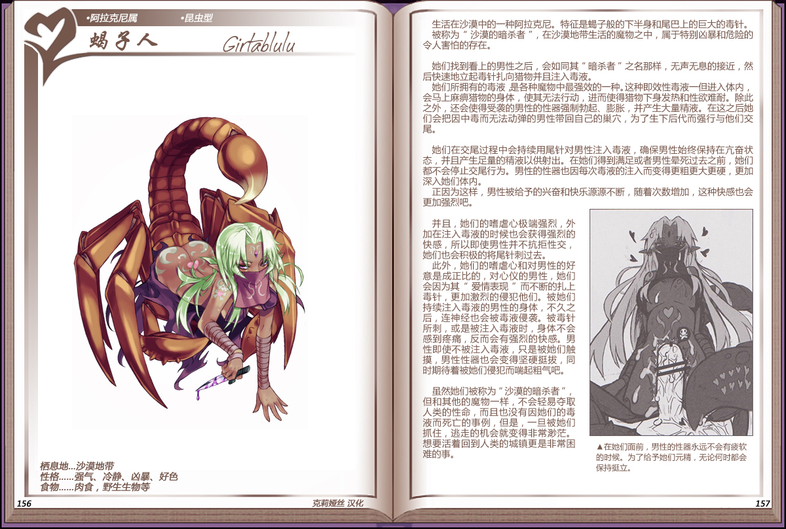

# 蝎子人

|名称|蝎子人|
|:-:|:-:|
|种属|阿拉克尼属|
|类型|昆虫型|
|栖息地|沙漠地带|
|性格|强气、冷静、凶暴、好色|
|食物|肉食，野生生物等|

生活在沙漠中的一种阿拉克尼。特征是蝎子般的下半身和尾巴上的巨大的毒针。

被称为“沙漠的暗杀者”，在沙漠地带生活的魔物之中，属于特别凶暴和危险的令人害怕的存在。

 

她们找到看上的男性之后，会如同其“暗杀者之名那样，无声无息的接近，然后快速地立起毒针扎向猎物并且注入毒液。

她们所拥有的毒液，是各种魔物中最强效的一种。这种即效性毒液一但进入体内会马上麻痹猎物的身体，使其无法行动，进而使得猎物下身发热和性欲难耐。除此之外，还会使得受袭的男性的性器强制勃起、膨胀，并产生大量精液。在这之后她们会把因中毒而无法动弹的男性带回自己的巢穴，为了生下后代而强行与他们交尾。

她们在交尾过程中会持续用尾针对男性注入毒液，确保男性始终保持在亢奋状态，并且产生足量的精液以供射出。在她们得到满足或者男性晕死过去之前，她们都不会停止交尾行为。男性的性器也因每次毒液的注入而变得更粗更大更硬，更加深入她们体内。

正因为这样，男性被给予的兴奋和快乐源源不断，随着次数增加，这种快感也会更加强烈吧。

 

并且，她们的嗜虐心极端强烈，外加在注入毒液的时候也会获得强烈的快感，所以即使男性并不抗拒性交，她们也会积极的将尾针刺过去
此外，她们的嗜虐心和对男性的好意是成正比的，对心仪的男性，她们会因为其“爱情表现”而不断的扎上毒针，更加激烈的侵犯他们。被她们持续注入毒液的男性的身体，不久之后，连神经也会被毒液侵袭。被毒针所刺，或是被注入毒液时，身体不会感到疼痛，反而会有强烈的快感。男性即使不被注入毒液，只是被她们触摸，男性性器也会变得坚硬挺拔，同时期待着被她们侵犯而喘起粗气吧。

 

虽然她们被称为“沙漠的暗杀者“ 但和其他的魔物一样，不会轻易夺取人类的性命，而且也没有因她们的毒液而死亡的事例，但是，一旦被她们抓住，逃走的机会就变得非常渺茫。想要活着回到人类的城镇更是非常困难的事。

---

附图： 