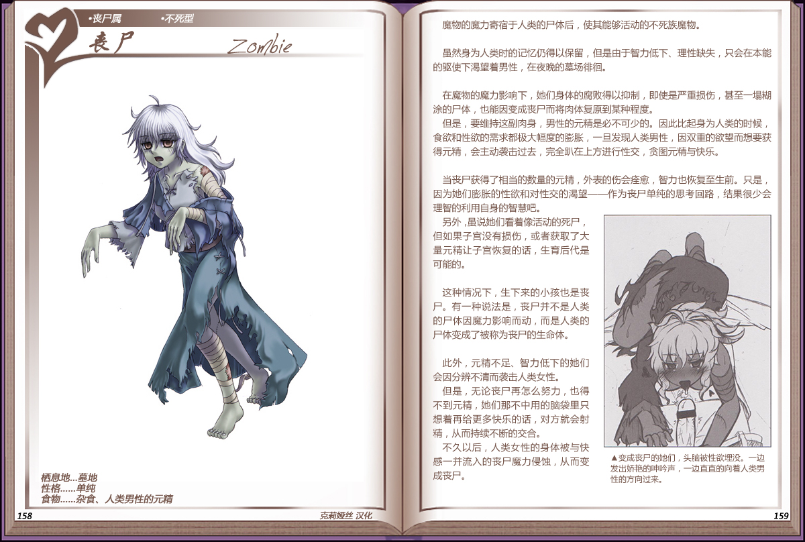

# 丧尸

|名称|丧尸|
|:-:|:-:|
|种属|丧尸属|
|类型|不死型|
|栖息地|墓地|
|性格|单纯|
|食物|杂食、人类男性的元精|

魔物的魔力寄宿于人类的尸体后，使其能够活动的不死族魔物。

 

虽然身为人类时的记忆仍得以保留，但是由于智力低下、理性缺失，只会在本能的驱使下渴望着男性，在夜晚的墓场徘徊。

 

在魔物的魔力影响下，她们身体的腐败得以抑制，即使是严重损伤，甚至一塌糊涂的尸体，也能因变成丧尸而将肉体复原到某种程度。

但是，要维持这副肉身，男性的元精是必不可少的。因此比起身为人类的时候食欲和性欲的需求都极大幅度的膨胀，一旦发现人类男性，因双重的欲望而想要获得元精，会主动袭击过去，完全趴在上方进行性交，贪图元精与快乐。

 

当丧获得了相当的数量的元精，外表的伤会痒愈，智力也恢复至生前。只是因为她们膨胀的性欲和对性交的渴望——作为丧尸单纯的思考回路，结果很少会理智的利用自身的智慧吧。

另外，虽说她们着着像活动的死尸但如果子宫没有损伤，或者获取了大量元精让子宫恢复的话，生育后代是可能的。

 

这种情况下，生下来的小孩也是丧尸。有一种说法是，丧尸并不是人类的尸体因魔力影响而动，而是人类的尸体变成了被称为丧尸的生命体。

 

此外，元精不足、智力低下的她们会因分辨不清而袭击人类女性。

但是，无论丧尸再怎么努力，也得不到元精，她们那不中用的脑袋里只想着再给更多快乐的话，对方就会射精，从而持续不断的交合。
不久以后，人类女性的身体被与快感一并流入的丧尸魔力侵蚀，从而变成丧尸。

---

附图： 