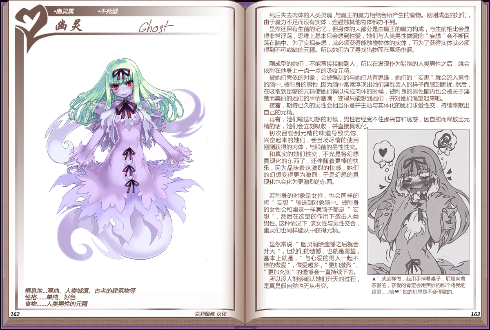

# 幽灵

|名称|幽灵|
|:-:|:-:|
|种属|幽灵属|
|类型|不死型|
|栖息地|墓地、人类城镇、古老的建筑物|
|性格|单纯、好色|
|食物|人类男性的元精|

死后失去肉体的人类灵魂，与魔王的魔力相结合所产生的魔物。刚刚成型的她们，由于魔力不足而没有实体，连碰触其他物体都办不到。

虽然还保有生前的记忆，但身体的大部分是由魔王的魔力构成，与生前相比会显得非常淫荡，思维上基本只会想到性爱，她们与人类男性做爱的“妄想”会不断回荡在脑中。为了实现妄想，就必须获得能触碰物体的实体，而为了获得实体就必须得到不可或缺的元精。所以她们为了寻找猎物而在墓场排间。

 

刚成型的她们，不能直接接触到人，所以在发现作为猎物的人类男性之后，就会依附在他身上一点一点的吸收元精。

被她们凭依的对象，会被强制的与她们共有思维，她们的“妄想”就会流入男性的脑中。被附身的男性，因为脑中常常浮现出她们淫乱丢人的样子而感到困扰。然后，在吸取到足够的元精使她们得以构成肉体的时候，被附身的男性脑内也会被关于淫荡而美丽的她们的事情塞满，变得只能想到她们，并对她们渴望起来吧。

接着，期待已久的男性会相当乐意并主动与实体化的她们求爱性交，持续奉献出自己的元精。

再有，她们输送幻想的时候，男性若经受不住那兴奋和诱惑，因自慰而释放出元精的话，她们会立刻吸收，并直接具现化。

初次品尝到元精的味道导致恍兴奋起来的她们，会当场尽情的使用刚刚获得的肉体，与眼前的男性性交。和真实的她们性交，不光是将幻想具现化的东西了，还伴随着更棒的快乐，因为品味着这激烈的快感，她们的幻想变得更为激烈，于是幻想的具现化也会化为更激烈的东西。

 

若附身的对象是女性，也会同样的将“妄想”输送到对象脑中。被附身的女性会和幽灵一样满脑子都是“妄想”，然后在欲望的作用下袭击人类男性。这种情况下该女性与男性交合幽灵们也同样能从中获得元精。

 

虽然常说“幽灵消除遗憾之后就会升天”，但她们的遗憾，也就是愿望基本上就是，“与心爱的男人一起不停的做爱”，做爱越多，“更加激烈”、“更加充实”的遗憾会一直持续下去。

所以没人能够确认她们升天的过程，是真是假自然也无从考究。

---

附图： 