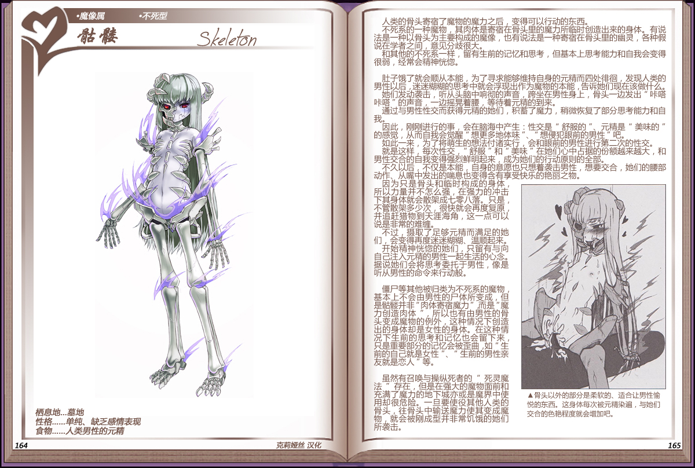

# 骷髅

|名称||
|:-:|:-:|
|种属|魔像属|
|类型|不死型|
|栖息地|墓地|
|性格|单纯、缺乏感情表现|
|食物|人类男性的元精|

人类的骨头寄宿了魔物的魔力之后，变得可以行动的东西。

不死系的一种魔物，其肉体是奇宿在膏头里的魔力所临时创造出来的身体。有说法是一种以骨头为主要构成的魔像，也有说法是一种寄宿在骨头里的幽灵，各种假说在学者之间，意见分歧很大。

和其他的不死系一样，留有生前的记忆和思考，但基本上思考能力和自我会变得很弱，经常会精神恍憋。

 

肚子饿了就会顺从本能，为了寻求能够维持自身的元精而四处迥，发现人类的男性以后，迷迷糊糊的思考中就会浮现出作为魔物的本能，告诉她们门现在该做什么她们爱动袭击，听从头脑中响彻的声音，跨坐在勇性身上，骨买一边发出“咔嗒咔嗒”的声音，一边摇晃着腰，等待着元精的到来。

通过与男性性交而获得元精的她们，积蓄了魔力，稍微恢复了部分思考能力和自我。

因此，刚刚进行的事，会在脑海中产生：性交是“舒服的”、元精是“美味的”的感觉，从而自我会觉醒“想更多地体味”、“想侵犯眼前的男性”吧。

如此一来，为了将萌生的想法付诸实行，会和眼前的男性进行第二次的性交。

就是这样，每次性交，“舒服”和“美味”在她们心中占据的份额越来越大，和男性交合的自我变得强烈鲜起来，成为她们的行动原则的全部。

不久以后，不夜是本能，自身的意愿也只想着袭击勇性，想要交合，她们的腰部动作、从嘴中发出的喘息也变得含有享受快乐的艳丽之物。

因为只是骨头和临时构成的身体所以力量并不怎么强，在强力的冲击下箕身体就会散架成七零八落。只是，不管散架多少次，很快就会再度复原并追赶猎物到天涯海角，这一点可以说是非常的难缠。

不过，摄取了足够元精而满足的她们，会变得再度迷迷糊糊、温顺起来开始精神恍惚的她们，只留有与向自已注入元精的男性一起生活的心念。据说她们会将思考委托于男性，像是听从男性的命令来行动般。

 

僵尸等其他被归类为不死系的魔物基本上不会由男性的尸体所变成，但是骷髅并非“肉体寄宿魔力”而是“魔力创造肉体”，所以也有由男性的骨头变成魔物的例外，这种情况下创造出的身体却是女性的身体。在这种情况下生前的考和记忆也会留下来只是重要部分的记忆会被歪曲如“生前的自己就是女性“、“生前的男性亲友就是恋人“等。

 

虽然有召唤与操纵死者的“死灵魔法”存在，但是在强大的魔物面前和充满了魔力的地下城亦或是魔界中使用却很危险。一旦要使役其他人类的骨头，往骨头中输送魔力使其变成魔物，就会被刚成型并非常饥饿的她们所袭击。

---

附图： 