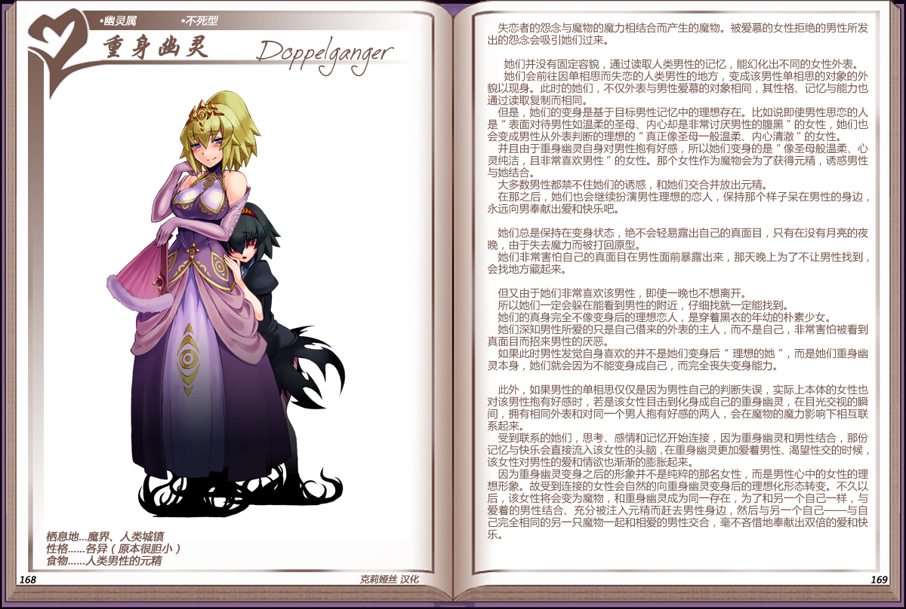

# 重身幽灵

|名称|重身幽灵|
|:-:|:-:|
|种属|幽灵属|
|类型|不死型|
|栖息地|魔界、人类城镇|
|性格|各异（原本很胆小）|
|食物|人类男性的元精|

失恋者的怨念与魔物的魔力相结合而产生的魔物。被爱慕的女性拒绝的男性所发出的怨念会吸引她们过来。

 

她们并没有固定容貌，通过读取人类男性的记忆，能化出不同的女性外表。

她们会前往因单相思而失恋的人类男性的地方，变成该男性单相思的对象的外貌以现身。此时的她们，不仅外表与男性爱慕的对象相同，其性格、记忆与能力也通过读取复制而相同。

但是，她们的变身是基于目标男性记忆中的理想存在。比如说即使男性思恋的人是“表面对待男性如温柔的圣母、内心却是非常讨厌男性的腹黑”的女性，她们也会变成男性丛外表判断的理想的“真正像圣母一般温柔、内心清澈”的女性。

并且由于重身幽灵自身对男性抱有好感，所以她们变身的是“像圣母般温柔、心灵纯洁，且非常喜欢男性”的女性。那个女性作为魔物会为了获得元精，诱惑男性与她结合。

大多数男性都禁不住她们的诱惑，和她们交合并放出元精。

在那之后，她们也会继续扮演男性理想的恋人，保持那个样子呆在男性的身边，永远向男奉献出爱和快乐吧。

 

她们总是保持在变身状态，绝不会轻易露出自己的真面目，只有在没有月亮的夜晚，由于失去魔力而被打回原型。

她们非常害怕自己的真面目在男性面前暴露出来，那天晚上为了不让男性找到，会找地方藏起来。

 

但又由于她们非常喜欢该男性，即使一晚也不想离开。

所以她们一定会躲在能看到男性的附近，仔细找就一定能找到。

她们的真身完全不像变身后的理想恋人，是穿着黑衣的年幼的朴素少女。

她们深知男性所爱的只是自己借来的外表的主人，而不是自己，非常害怕被看到真面目而招来男性的厌恶。

如果此时男性发觉自身喜欢的并不是她们变身后“理想的她”，而是她们重身幽灵本身，她们就会因为不能变身成自己，而完全丧失变身能力。

 

此外，如果男性的单相思仅仅是因为男性自己的判断失误，实际上本体的女性也对该男性抱有好感时，若是该女性目击到化身成自己的重身幽灵，在目光交视的瞬间，拥有相同外表和对同一个男人抱有好感的两人，会在魔物的魔力影响下相互联系起来。

受到联系的她们，思考、感情和记忆开始连接，因为重身幽灵和男性结合，那份记忆与快乐会直接流入该女性的头脑，在重身幽灵更加爱着男性、渴望性交的时候，该女性对男性的爱和情欲也渐渐的膨胀起来。

因为重身幽灵变身之后的形象并不是纯粹的那名女性，而是男性心中的女性的理想形象。故受到连接的女性会自然的向重身幽灵变身后的理想化形态转变。不久以后，该女性将会变为魔物，和重身幽灵成为同一存在，为了和另一个自己一样，与爱着的男性结合、充分被注入元精而赶去男性身边，然后与另一个自己完全相同的另一只魔物一起和相爱的男性交合，毫不客惜地奉献出双倍的爱和快乐。

---

附图： 