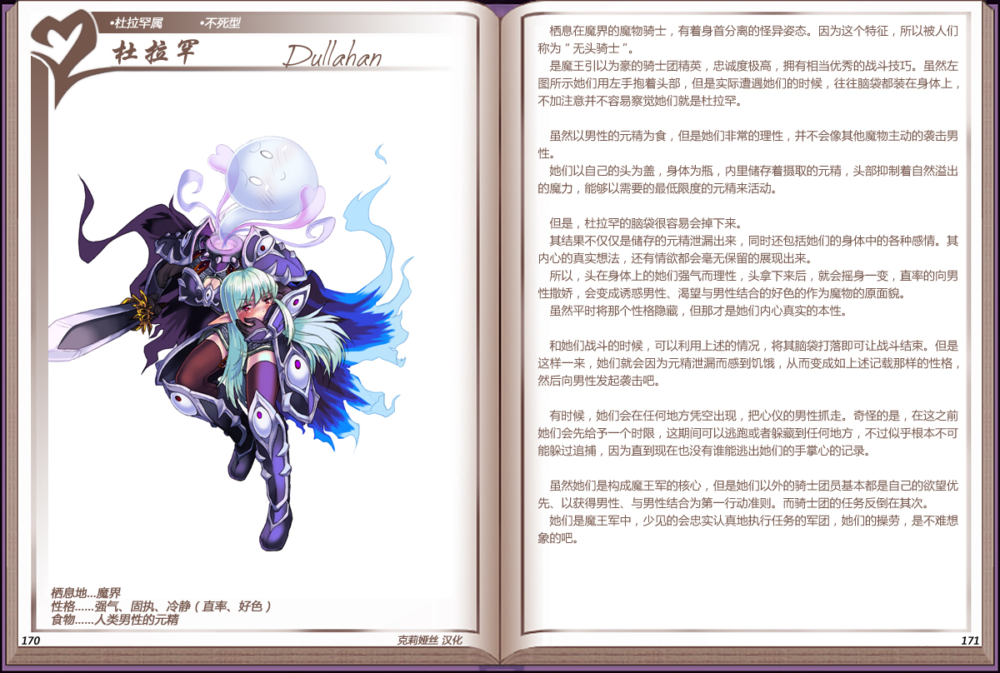

# 杜拉罕

|名称|杜拉罕|
|:-:|:-:|
|种属|杜拉罕属|
|类型|不死型|
|栖息地|魔界|
|性格|强气、固执、冷静（直率、好色）|
|食物|人类男性的元精|

息在魔界的魔物骑士，有着身首分离的怪异姿态。因为这个特征，所以被人们称为“无头骑士”。

是魔王引以为豪的骑士团精英，忠诚度极高，拥有相当优秀的战斗技巧。虽然左图所示她们用左手抱着头部，但是实际遭遇她们的时候，往往脑袋都装在身体上，不加注意并不容易察觉她们就是杜拉罕。

 

虽然以男性的元精为食，但是她们非常的理性，并不会像其他魔物主动的袭击男性。

她们以自己的头为盖，身体为瓶，内里储存着摄取的元精，头部抑制着自然溢出的魔力，能够以需要的最低限度的元精来活动。

 

但是，杜拉罕的脑袋很容易会掉下来。

其结果不仅仅是储存的元精泄漏出来，同时还包括她们的身体中的各种感情。其内心的真实想法，还有情欲都会毫无保留的展现出来。

所以，头在身体上的她们强气而理性，头拿下来后，就会摇身一变，直率的向男性撒娇，会变成诱惑男性、渴望与男性结合的好色的作为魔物的原面貌。虽然平时将那个性格隐藏，但那才是她们内心真实的本性。

 

和她们战斗的时候，可以利用上述的情况，将其脑袋打落即可让战斗结束。但是这样一来，她们就会因为元精泄漏而感到饥饿，从而变成如上述记载那样的性格，然后向男性发起袭击吧。

 

有时候，她们会在任何地方凭空出现，把心仪的男性抓走。奇怪的是，在这之前她们会先给予一个时限，这期间可以逃跑或者躲藏到任何地方，不过似乎根本不可能躲过追捕，因为直到现在也没有谁能逃出她们的手掌心的记录。

 

虽然她们是构成魔王军的核心，但是她们以外的骑士团员基本都是自己的欲望优先、以获得男性、与男性结合为第一行动准则。而骑士团的任务反倒在其次。

她们是魔王军中，少见的会忠实认真地热行任务的军团，她们的操劳，是不难想象的吧。

---

附图： 
