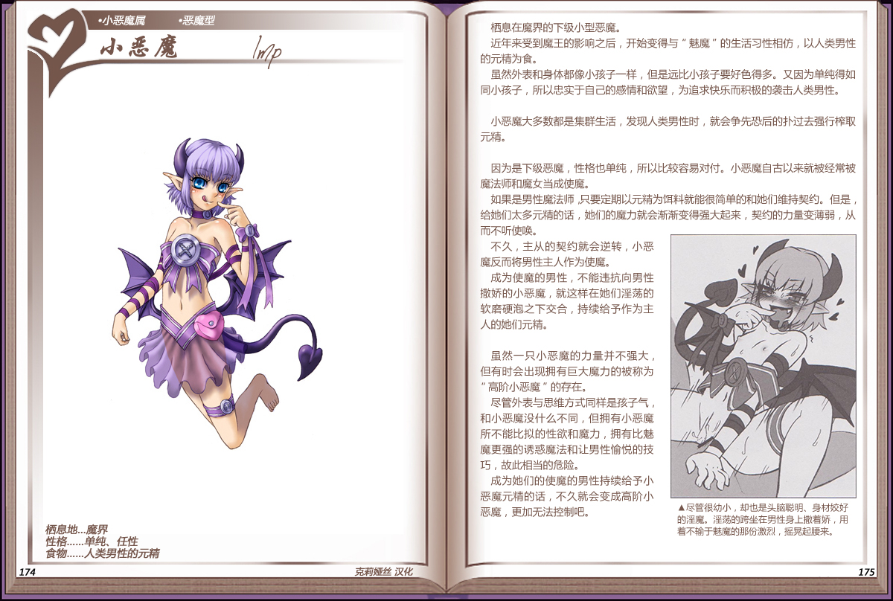

# 小恶魔

|名称|小恶魔|
|:-:|:-:|
|种属|小恶魔属|
|类型|恶魔型|
|栖息地|魔界|
|性格|单纯、任性|
|食物|人类男性的元精|

栖息在魔界的下级小型恶魔。

近年来受到魔王的影响之后，开始变得与“魅魔”的生活习性相仿，以人类男性的元精为食。

虽然外表和身体都像小孩子一样，但是远比小孩子要好色得多。又因为单纯得如同小孩子，所以忠实于自己的感情和欲望，为追求快乐而积极的袭击人类男性。

 

小恶魔大多数都是集群生活，发现人类男性时，就会争先恐后的扑过去强行榨取元精。

 

因为是下级恶魔，性格也单纯，所以比较容易对付。小恶魔自古以来就被经常被魔法师和魔女当成使魔。

如果是男性魔法师只要定期以元精为饵料就能很简单的和她们维持契约。但是给她们太多元精的话，她们的魔力就会渐渐变得强大起来，契约的力量变薄弱，从而不听使唤。

不久，主从的契约就会逆转，小恶魔反而将男性主人作为使魔。

成为使魔的男性，不能违抗向男性撒娇的小恶魔，就这样在她们淫荡的软磨硬泡之下交合，持续给予作为主人的她们元精。

 

虽然一只小恶魔的力量并不强大，但有时会出现拥有巨大魔力的被称为“高阶小恶魔“的存在。

尽管外表与思维方式同样是孩子气和小恶魔没什么不同，但拥有小恶魔所不能比拟的性欲和魔力，拥有比魅魔更强的诱惑魔法和让男性愉悦的技巧，故此相当的危险。

成为她们的使魔的男性持续给予小恶魔元精的话，不久就会变成高阶小恶魔，更加无法控制吧。

---

附图： 