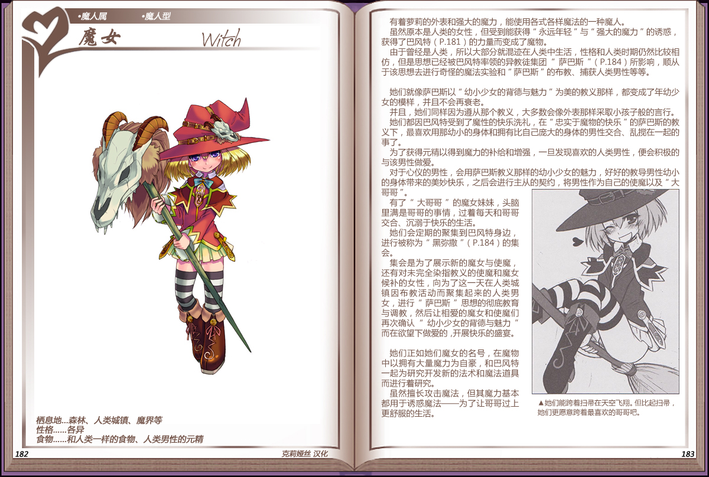

# 魔女

|名称|魔女|
|:-:|:-:|
|种属|魔人属|
|类型|魔人型|
|栖息地|森林、人类城镇、魔界等|
|性格|各异|
|食物|和人类一样的食物、人类男性的元精|

有着萝莉的外表和强大的魔力，能使用各式各样魔法的一种魔人。

虽然原本是人类的女性，但受到能获得“永远年轻”与“强大的魔力“的诱惑，获得了[巴风特](82巴风特.md)的力量而变成了魔物。

由于曾经是人类，所以大部分就混迹在人类中生活，性格和人类时期仍然比较相仿，但是思想已经被巴风特率领的异教徒集团[“萨巴斯”](资料萨巴斯.md)所影响，顺从于该思想去进行奇怪的魔法实验和”萨巴斯”的布教、捕获人类男性等等。

 

她们就像萨巴斯以“幼小少女的背德与魅力”为美的教义那样，都变成了年幼少女的模样，并且不会再衰老。

并且，她们同样因为遵从那个教义，大多数会像外表那样采取小孩子般的言行。她们都因巴风特受到了魔性的快乐洗礼，在“忠实于魔物的快乐”的萨巴斯的教义下，最喜欢用那幼小的身体和拥有比自己庞大的身体的男性交合、乱搅在一起的事了。

为了获得元精以得到魔力的补给和增强，一旦发现喜欢的人类男性，便会积极的与该男性做爱。

对于心仪的男性，会用萨巴斯教义那样的幼小少女的魅力，好好的教导男性幼小的身体带来的美妙快乐，之后会进行主从的契约，将男性作为自己的使魔以及“大哥哥”。

有了“大哥哥”的魔女妹妹，头脑里满是哥哥的事情，过着每天和哥哥交合、沉溺于快乐的生活。

她们会定期的聚集到巴风特身边进行被称为[“黑弥撒”](资料萨巴斯.md#3快乐的黑弥撒)的集会。

集会是为了展示新的魔女与使魔还有对未完全染指教义的使魔和魔女候补的女性，向为了这一天在人类城镇因布教活动而聚集起来的人类男女，进行“萨巴斯”思想的彻底教育与调教，然后让相爱的魔女和使魔们再次确认”幼小少女的背德与魅力而在欲望下做爱的，开展快乐的盛宴。

 

她们正如她们魔女的名号，在魔物中以拥有大量魔力为自豪，和巴风特一起为研究开发新的法术和魔法道具而进行着研究。

虽然擅长攻击魔法，但其魔力基本都用于诱惑魔法——为了让哥哥过上更舒服的生活。

---

附图： 