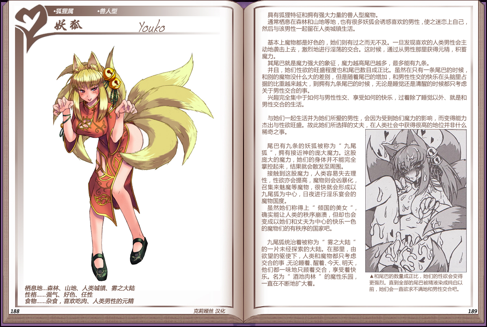

# 妖狐

|名称|妖狐|
|:-:|:-:|
|种属|狐狸属|
|类型|兽人型|
|栖息地|森林、山地、人类城镇、雾之大陆|
|性格|强气、好色、任性|
|食物|杂食，喜欢吃肉、人类男性的元精|

具有狐狸特征和拥有强大力量的兽人型魔物。

通常栖息在森林和山地等地，也有很多妖狐会诱惑喜欢的男性，使之迷恋上自己，然后与该男性一起留在人类城镇生活。

 

基本上魔物都是好色的，她们则有过之而无不及。一旦发现喜欢的人类男性会主动地袭击上去，激烈地进行淫荡的交合。这时候，通过从男性那里获得元精，积蓄魔力。

其尾巴就是魔力强大的象征，魔力越高尾巴越多，最多能有九条。

并且，她们性欲的旺盛程度也和尾巴数目成正比。虽然在只有一条尾巴的时候和别的魔物没什么大的差别，但是随着尾巴的增加，和男性性交的快乐在头脑里占据的比重越来越大，到拥有九条尾巴的时候，无论是睡觉还是清醒的时候都只考虑关于男性交合的事。

兴趣完全集中于如何与男性性交、享受如何的快乐，过着除了睡觉以外、就是和男性交合的生活。

 

与她们一起生活并为她们所爱的男性，会因为受到她们魔力的影响，而变得能力杰出与性欲旺盛。故此她们所选择的丈夫，在人类社会中获得很高的地位并非什么稀奇之事。

 

尾巴有九条的妖狐被称为“九尾狐“，拥有接近神的庞大魔力。这股庞大的魔力，她们的身体并不能完全掌控起来，结果就会散发至周围。

接触到这股魔力，人类容易失去理性，性欲亦会提高，魔物则会凶暴化召集来魅魔等魔物，很快就会形成以九尾狐为中心，日夜进行淫乐宴会的魔物国度。

虽然她们称得上“倾国的美女“ 确实能让人类的秩序崩溃，但却也会变成以她们和丈夫为中心的快乐一色的魔物们的有秩序的国家吧。

 

九尾狐统治着被称为“雾之大陆“ 的一片未经探索的大陆。在那里，由欲望的驱使下，人类和魔物都只考虑交合的事无论睡着、醒着、今天、明天他们都一味地只顾着交合，享受着快乐。名为“酒池肉林”的魔性乐园，一直在不断地扩大着。

---

附图： 