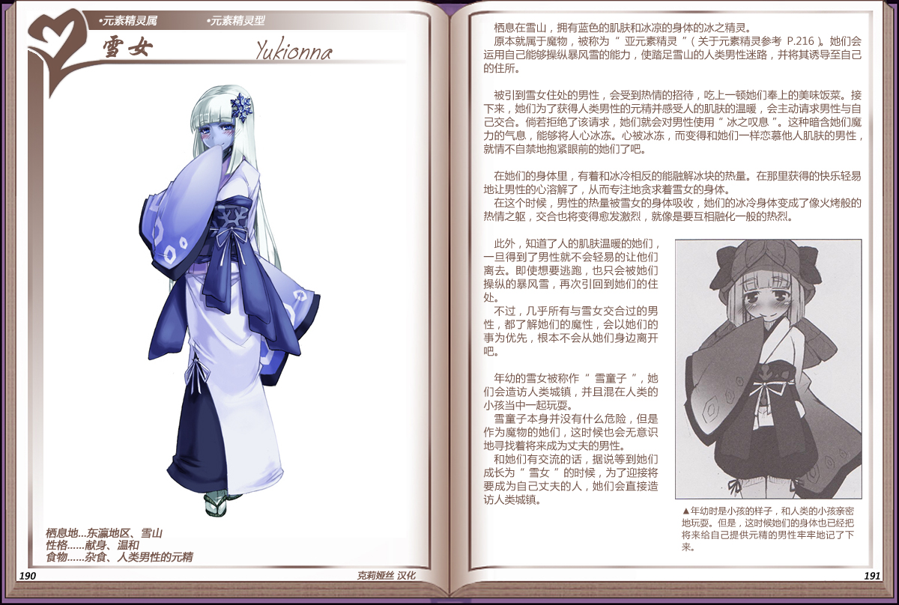

# 雪女

|名称|雪女|
|:-:|:-:|
|种属|元素精灵属|
|类型|元素精灵型|
|栖息地|东瀛地区、雪山|
|性格|献身、温和|
|食物|杂食、人类男性的元精|

栖息在雪山，拥有蓝色的肌肤和冰凉的身体的冰之精灵。

原本就属于魔物，被称为“亚元素精灵”（参见[元素精灵](资料元素精灵.md#4原本是魔物的亚精灵)）她们会运用自己能够操纵暴风雪的能力，使踏足雪山的人类男性迷路，并将其诱导至自己的住所。

 

被引到雪女住处的男性，会受到热情的招待，吃上一顿她们奉上的美味饭菜。接下来，她们为了获得人类男性的元精并感受人的肌肤的温暖，会主动请求男性与自己交合。尚若拒绝了该请求，她们就会对男性使用“冰之叹息”。这种暗含她们魔力的气息，能够将人心冰冻。心被冰冻，而变得和她们一样恋慕他人肌肤的男性，就情不自禁地抱紧眼前的她们了吧。

 

在她们的身体里，有着和冰冷相反的能融解冰块的热量。在那里获得的快乐轻易地让男性的心溶解了，从而专注地贪求着雪女的身体。

在这个时候，男性的热量被雪女的身体吸收，她们的冰冷身体变成了像火烤般的热情之躯，交合也将变得愈发激烈，就像是要互相融化一般的热烈。

 

此外，知道了人的肌肤温暖的她们旦得到了男性就不会轻易的让他们离去。即使想要逃跑，也只会被她们操纵的暴风雪，再次引回到她们的住处。

不过，几乎所有与雪女交合过的男性，都了解她们的魔性，会以她们的事为优先，根本不会从她们身边离开吧。

 

年幼的雪女被称作“雪童子”，她们会造访人类城镇，并且混在人类的小孩当中一起玩耍。

雪童子本身并没有什么危险，但是作为魔物的她们，这时候也会无意识地寻找着将来成为丈夫的男性。

和她们有交流的话，据说等到她们成长为“雪女”的时候，为了迎接将要成为自己丈夫的人，她们会直接造访人类城镇。

---

附图： 