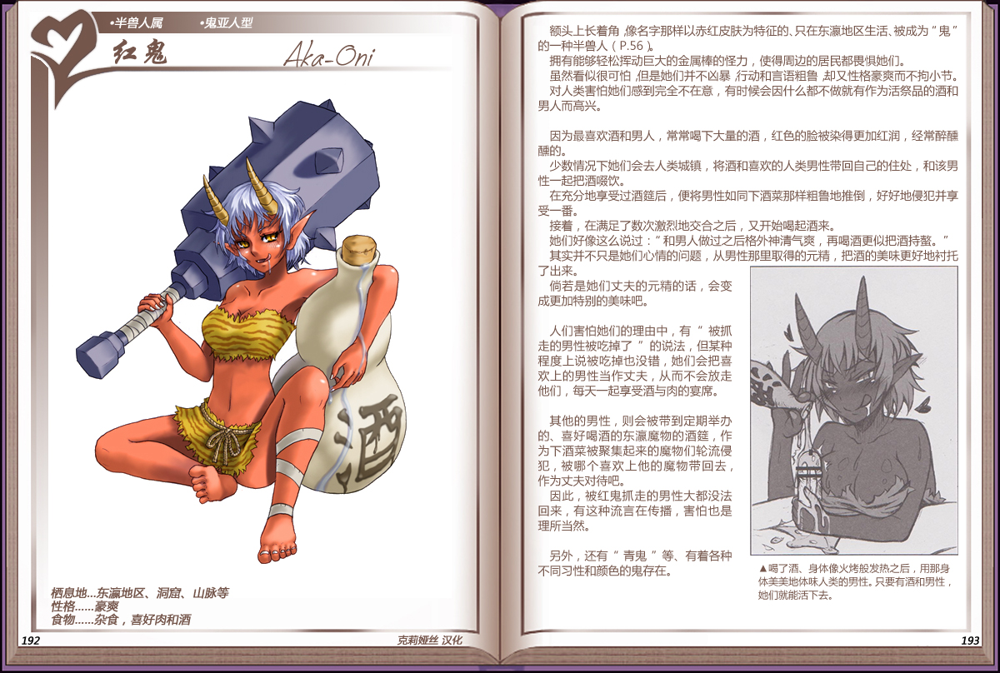

# 红鬼

|名称|红鬼|
|:-:|:-:|
|种属|半兽人属|
|类型|鬼亚人型|
|栖息地|东瀛地区、洞窟、山脉|
|性格|豪爽|
|食物|杂食，喜好肉和酒|

额头上长着角像名字那样以赤红皮肤为特征的、只在东瀛地区生活、被成为”鬼” 的一种[半兽人](22半兽人.md)。

拥有能够轻松挥动巨大的金属棒的怪力，使得周边的居民都畏惧她们。

虽然看似很可怕，但是她们并不凶暴行动和言语粗鲁却又性格豪爽而不拘小节。

对人类害怕她们感到完全不在意，有时候会因什么都不做就有作为活祭品的酒和男人而高兴。

 

因为最喜欢酒和男人，常常喝下大量的酒，红色的脸被染得更加红润，经常醉醺醺的。

少数情况下她们会去人类城镇，将酒和喜欢的人类男性带回自己的住处，和该男性一起把酒啜饮。

在充分地享受过酒链后，便将男性如同下酒菜那样粗鲁地推倒，好好地侵犯并享受一番。

接着，在满足了数次激烈地交合之后，又开始喝起酒来。

她们好像这么说过：“和男人做过之后格外神清气爽，再喝酒更似把酒持螯。”

其实并不只是她们心情的问题，从男性那里取得的元精，把酒的美味更好地衬托了出来。

尚若是她们丈夫的元精的话，会变成更加特别的美味吧。

 

人们害怕她们的理由中，有“被抓走的男性被吃掉了”的说法，但某种程度上说被吃掉也没错，她们会把喜欢上的男性当作丈夫，从而不会放走他们，每天一起享受酒与肉的宴席。

 

其他的男性，则会被带到定期举办的、喜好喝酒的东瀛魔物的酒链，作为下酒菜被聚集起来的魔物们轮流侵犯，被哪个喜欢上他的魔物带回去，作为丈夫对待吧。

因此，被红鬼抓走的男性大都没法回来，有这种流言在传播，害怕也是理所当然。

 

另外，还有“青鬼”等、有着各种不同习性和颜色的鬼存在。

---

附图： 