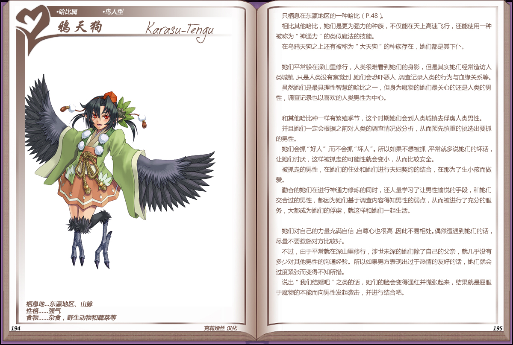

# 鸦天狗

|名称|鸦天狗|
|:-:|:-:|
|种属|哈比属|
|类型|鸟人型|
|栖息地|东瀛地区、山脉|
|性格|强气|
|食物|杂食，野生动物和蔬菜等|

只栖息在东瀛地区的一种[哈比](19哈比.md)。

相比其他哈比，她们是更为强力的种族，不仅能在天上高速飞行，还能使用一种，被称为“神通力”的类似魔法的技能。

在乌鸦天狗之上还有被称为“大天狗”的种族存在，她们都是其下仆。

 

她们平常躲在深山里修行，人类很难看到她们的身影，但是其实她们经常造访人类城镇，只是人类没有察觉到，她们会恐吓恶人调查记录人类的行为与血缘关系等。
虽然她们是最具理性智慧的哈比之一，但身为魔物的她们最关心的还是人类的男性，调查记录也以喜欢的人类男性为中心。

 

和其他哈比种一样有繁殖季节，这个时期她们会到人类城镇去俘虏人类男性。

并且她们一定会根据之前对人类的调查情况做分析，从而预先慎重的挑选出要抓的男性。

她们会抓“好人”而不会抓“坏人”。所以如果不想被抓平常就多说她们的坏话，让她们讨厌，这样被抓走的可能性就会变小，从而比较安全。

被抓走的男性，在她们的住处和她们进行夫妇契约的结合，在那为了生小孩而做爱。

勒奋的她们在进行神通力修炼的同时，还大量学习了让男性愉悦的手段，和她们交合过的男性，都因为她们基于调查内容得知男性的弱点，从而被进行了充分的服务，大都成为她们的俘虏，就这样和她们一起生活。

 

她们对自己的力量充满自信，自尊心也很高因此不易相处。偶然遭遇到她们的话，尽量不要惹怒对方比较好。

不过，由于平常就在深山里修行，涉世未深的她们除了自己的父亲，就几乎没有多少对其他男性的沟通经验。所以如果男方表现出过于热情的友好的话，她们就会过度紧张而变得不知所措。

说出“我们结婚吧”之类的话，她们的脸会变得通红并慌张起来，结果就是屈服于魔物的本能而向男性发起袭击，并进行结合吧。

---

附图： 