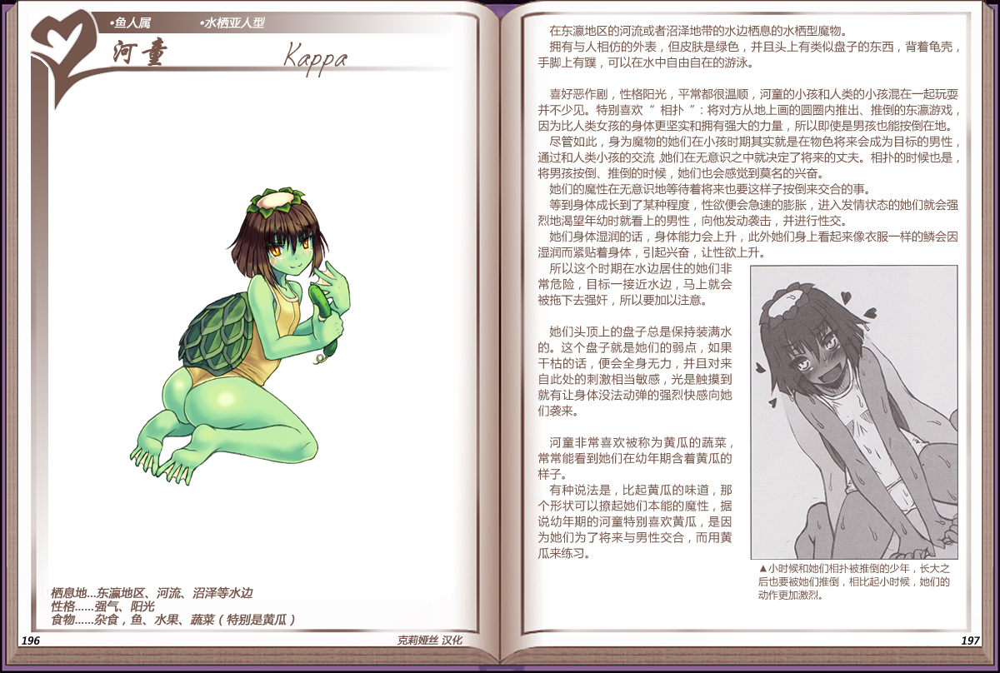

# 河童

|名称|河童|
|:-:|:-:|
|种属|鱼人属|
|类型|水栖亚人型|
|栖息地|东瀛地区、河流、沼泽等水边|
|性格|强气、阳光|
|食物|杂食，鱼、水果、蔬菜（特别是黄瓜）|

在东瀛地区的河流或者沼泽地带的水边栖息的水栖型魔物。

拥有与人相仿的外表，但皮肤是绿色，并且头上有类似盘子的东西，背着角壳手脚上有蹼，可以在水中自由自在的游泳。

 

喜好恶作剧，性格阳光，平常都很温顺，河童的小孩和人类的小孩混在一起玩耍并不少见。特别喜欢“相扑”：将对方从地上画的圆圈内推出、推倒的东瀛游戏，因为比人类女孩的身体更坚实和拥有强大的力量，所以即使是男孩也能按倒在地。

尽管如此，身为魔物的她们在小孩时期其实就是在物色将来会成为目标的男性，通过和人类小孩的交流她们在无意识之中就决定了将来的丈夫。相扑的时候也是，将男孩按倒、推倒的时候，她们也会感觉到莫名的兴奋。

她们的魔性在无意识地等待着将来也要这样子按倒来交合的事。

等到身体成长到了某种程度，性欲便会急速的膨胀，进入发情状态的她们就会强烈地渴望年幼时就看上的男性，向他发动袭击，并进行性交。

她们身体湿润的话，身体能力会上升，此外她们身上看起来像衣服一样的鳞会因湿润而紧贴着身体，引起兴奋，让性欲上升。

所以这个时期在水边居住的她们非常危险，目标一接近水边，马上就会被拖下去强奸，所以要加以注意。

 

她们头顶上的盘子总是保持装满水的。这个盘子就是她们的弱点，如果干枯的话，便会全身无力，并且对来自此处的刺激相当敏感，光是触摸到就有让身体没法动弹的强烈快感向她们袭来。

 

河童非常喜欢被称为黄瓜的蔬菜常常能看到她们在幼年期含着黄瓜的样子。

有种说法是，比起黄瓜的味道，那个形状可以擦起她们本能的魔性，据说幼年期的河童特别喜欢黄瓜，是因为她们为了将来与男性交合，而用黄瓜来练习。

---

附图： 