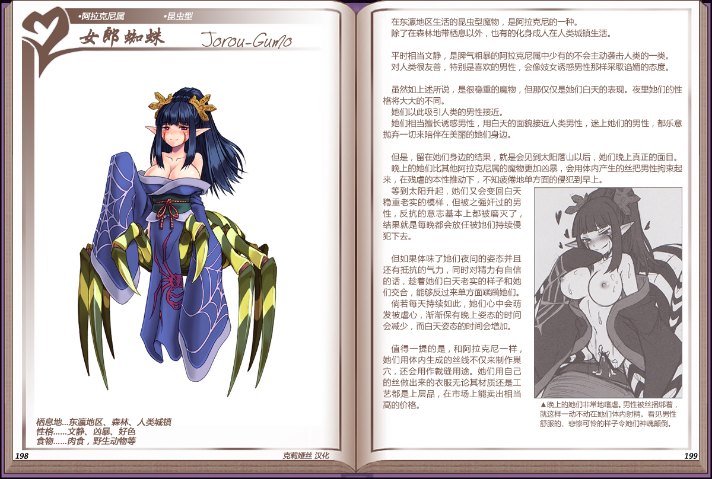

# 女郎蜘蛛

|名称|女郎蜘蛛|
|:-:|:-:|
|种属|阿拉克尼属|
|类型|昆虫型|
|栖息地|东瀛地区、森林、人类城镇|
|性格|文静、凶暴、好色|
|食物|肉食，野生动物等|

在东瀛地区生活的昆虫型魔物，是[阿拉克尼](24阿拉克尼.md)的一种。

除了在森林地带栖息以外，也有的化身成人在人类城镇生活。

 

平时相当文静，是脾气粗暴的阿拉克尼属中少有的不会主动袭击人类的一类。

对人类很友善，特别是喜欢的男性，会像妓女诱惑男性那样采取谄媚的态度。

 

虽然如上述所说，是很稳重的魔物，但那仅仅是她们白天的表现。夜里她们的性格将大大的不同。

她们以此吸引人类的男性接近。

她们相当擅长诱惑男性，用白天的面貌接近人类男性，迷上她们的男性，都乐意抛弃一切来陪伴在美丽的她们身边。

 

但是，留在她们身边的结果，就是会见到太阳落山以后，她们晚上真正的面目。晚上的她们比其他阿拉克尼属的魔物更加凶暴，会用体内产生的丝把男性拘束起来，在残虐的本性推动下，不知疲倦地单方面的侵犯到早上。

等到太阳升起，她们又会变回白天稳重老实的模样，但被之强奸过的男性，反抗的意志基本上都被磨灭了结果就是每晚都会放任被她们持续侵犯下去。

但如果体味了她们夜间的姿态并且还有抵抗的气力，同时对精力有自信的话，趁着她们白天老实的样子和她们交合，能够反过来单方面躁瞄她们。尚若每天持续如此，她们心中会萌发被虐心，渐渐保有晚上姿态的时间会减少，而白天姿态的时间会增加。

 

值得一提的是，和阿拉克尼一样她们用体内生成的丝线不仅来制作巢穴，还会用作裁缝用途。她们用自己的丝做出来的衣服无论其材质还是工艺都是上层品，在市场上能卖出相当高的价格。

---

附图： 