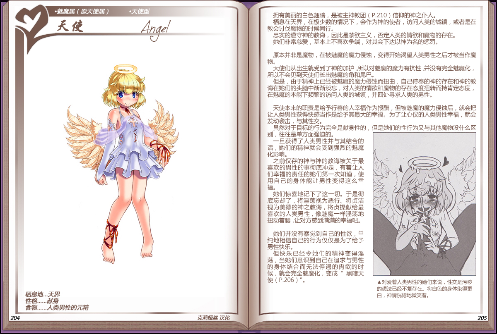

# 天使

|名称|天使|
|:-:|:-:|
|种属|魅魔属（原天使属）|
|类型|天使型|
|栖息地|天界|
|性格|献身|
|食物|人类男性的元精|

拥有美丽的白色翅膀，是被[主神教团](资料神之眷属与世界的构造.md#1-1教团和反魔物国家)信仰的神之仆人，

栖息在天界，在极少数的情况下，会作为神的使者，访问人类的城镇，或者是在教会讨伐魔物的时候同行。

忠实的遵守神的教海，因此是禁欲主义，否定人类的情欲和魔物的存在。她们非常慈爱，基本上不喜欢争端，对其会下达以神为名的惩罚。

 

原本并非是魔物，在被魅魔的魔力侵蚀，变得开始渴望人类男性之后才被当作魔物。

天使们从出生就受到了神的加护，所以对魅魔的魔力有抗性并没有完全魅魔化，所以不会见到天使们长出魅魔的角和尾巴。

但是，由于精神上已经被魅魔的魔力侵蚀而扭曲，自己侍奉的神的存在和神的教海在她们的头脑中渐渐淡忘，对人类的情欲和魔物的存在态度扭转而持肯定态度，在魅魔的本能下频繁的访问人类的城镇，并四处寻求人类的男性。

 

天使本来的职责是给予行善的人幸福作为报酬，但被魅魔的魔力侵蚀后，就会把让人类男性获得快感当作是给予其最大的幸福。为了让心仪的人类男性幸福，就会发动袭击，与其性交。

虽然对于目标的行为完全是献身性的，但是她们的性行为又与其他魔物没什么区别，往往是单方面强迫的。

旦获得了人类男性并与其结合的话，她们的精神就会受到强烈的魅魔化影响。

之前仅存的神与神的教海被关于最喜欢的男性的事彻底冲走，有着让人们幸福的责任的她们第一次知道，使用自己的身体能让男性变得这么幸福。

 

她们惊喜地记下了这一切。于是彻底忘却了，将淫荡视为恶行、将贞洁视为美德的神之教海，将贞操献给最喜欢的人类男性，像魅魔一样淫荡地扭动着腰，让对方感到满满的幸福吧。

她们并没有察觉到自己的性欲，单纯地相信自己的行为仅仅是为了给予男性快乐。

但快乐已经令她们的精神变得淫荡，当她们意识到自己在追求与男性的身体结合而无法停遏的肉欲的时候，就会完全魅魔化，变成[“黑暗天使"](92黑暗天使.md)。

---

附图： 