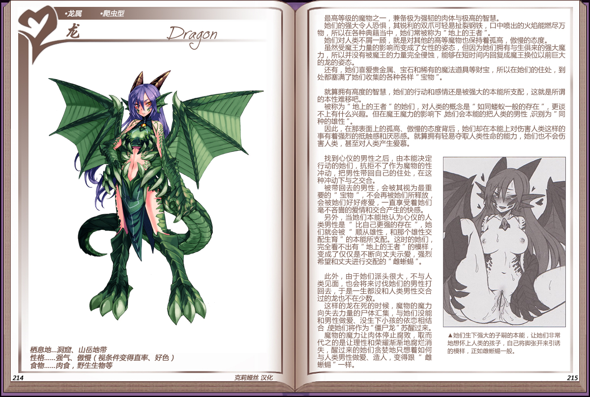

# 龙

|名称|龙|
|:-:|:-:|
|种属|龙属|
|类型|爬虫型|
|栖息地|洞窟、山岳地带|
|性格|强气、傲慢（视条件变得直率、好色）|
|食物|肉食，野生生物等|

最高等级的魔物之一，兼备极为强韧的肉体与极高的智慧。

她们的强大令人恐惧，其锐利的双爪可轻易扯裂钢铁，口中喷出的火焰能燃尽万物，所以在各种典籍当中，她们常被称为“地上的王者”。

她们对人类不屑一顾，就是对其他的高等魔物也保持着孤高，傲慢的态度。

虽然受魔主力量的影响而变成了女性的姿态，但因为她们拥有与生俱来的强大魔力，所以并没有被魔主的力量完全侵蚀，能够在短时间内回复成魔王换位以前巨大的龙的姿态。

还有，她们喜爱贵金属、宝石和稀有的魔法道具等财宝，所以在她们的住处，到处都塞满了她衍收集的各种各样“宝物“。

 

就算拥有高度的智慧，她们的行动和感情还是被强大的本能所支配，这就是所谓的本性难移吧。

被称为”地上的王者”的她们，对人类的概念是“如同蝼蚁一般的存在”，更谈不上有什么兴趣。但在魔主魔力的影响下她们会本能的把人类的男性，识别为“同种的雄性”。

因此，在那表面上的孤高、傲慢的态度背后，她们却在本能上对伤害人类这样的事有着强烈的抵触感和厌恶感。就算拥有轻易夺取人类性命的能力，她们也不会伤害人类，甚至对人类产生爱慕。

 

找到心仪的男性之后，由本能决定行动的她们，抗拒不了作为魔物的性冲动，把男性带回自己的住处，在这种冲动下与之交合。被带回去的男性，会被其视为最重要的”宝物“，不会再被她们所释放，会被她们好好疼爱，一直享受着她们毫不吝啬的爱情和交合产生的快感。

另外，当她们本能地认为心仪的人类男性是”比自己更强的存在”，她们就会被“顺从雄性，和那个雄性交配生育”的本能所支配。这时的她们完全看不出有“地上的王者“的模样，变成了仅仅是不断向丈夫示爱，强烈希望和丈夫进行交配的“雌蜥蜴”。

 

此外，由于她们派头很大，不与人类见面，也会将来讨伐她们的男性打回去，于是一生都没和人类男性交合过的龙也不在少数。

这样的龙在死的时候，魔物的魔力向失去力量的尸体汇集，与她们没能和男性做爱、没生下小孩的依恋相结合，使她们将作为“僵尸龙“苏醒过来。

魔物的魔力让肉体停止腐败，取而代之的是让理性和荣耀渐渐地腐烂消失，醒过来的她们贪婪地只想着如何与人类男性做爱、造人，变得跟“雌蜥蜴“一样。

---

附图： 