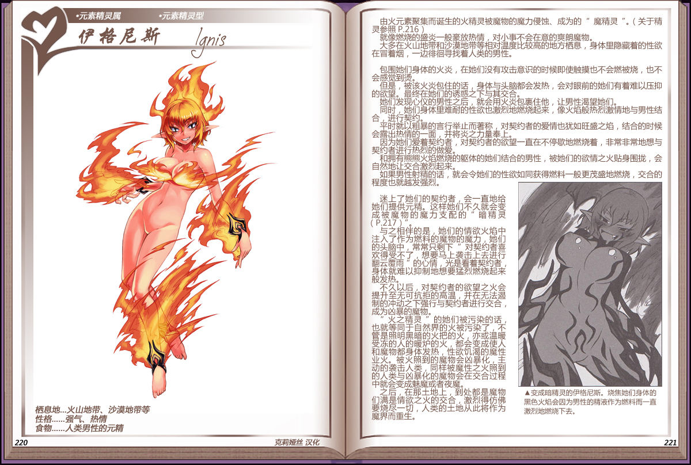

# 伊格尼斯

|名称|伊格尼斯|
|:-:|:-:|
|种属|元素精灵属|
|类型|元素精灵型|
|栖息地|火山地带、沙漠地带等|
|性格|强气、热情|
|食物|人类男性的元精|

由火元素聚集而诞生的火精灵被魔物的魔力侵蚀、成为的[魔精灵](资料元素精灵.md#2魔性在体内寄宿的魔精灵)。

就像燃烧的盛炎一般豪放热情，对小事不会在意的爽朗魔物。

大多在火山地带和沙漠地带等相对温度比较高的地方栖息，身体里隐藏着的性欲在冒着烟，一边徘徊寻找着人类的男性。

 

包围她们身体的火炎，在她们没有攻击意识的时候即使触摸也不会燃被烧，也不会感觉到烫。

但是，被该火炎包住的话，身体与头脑都会发热，会对眼前的她们有着难以压抑的欲望。最终在她们的诱惑之下写其交合。

她们发现心仪的男性之后，就会用火炎包裹住他，让男性渴望她们。

同时，她们身体重难耐的性欲也激烈地燃烧起来，像火焰般热烈激情地与男性结合，进行契约。

平时就以粗暴的言行举止而著称，对契约者的爱情也犹如旺盛之焰，结合的时候会露出热情的一面，并将炎之力量奉上。

为她们爱着契约者，对契约者的欲望一直在不停歇地燃烧着，非常非常地想与契约者进行热烈的做爱。

和拥有熊熊火焰燃烧的躯体的她们结合的男性，被她们的欲情之火贴身围拢，会自然地让交合激烈起来。

如果剪性射精的话，就会令她们的性欲如同获得燃料一般更茂盛地燃烧，交合的程度也就越发强烈。

 

迷上了她们的契约者，会一直地给，她们提供元精。这样她们不久就会变成被魔物的魔力支配的[“暗精灵”](资料元素精灵.md#3创造出魔界的暗精灵)。

与之相伴的是，她们的情欲火焰中注入了作为燃料的魔物的魔力，她们，的头脑中，常常只剩下”对契约者喜欢得受不了，想要马上袭击上去进行翻云覆雨”的心情，光是看着契约者身体就难以抑制地想要猛烈燃烧起来般发热。

不久以后，对契约者的欲望之火会提升室无可抗拒的高温，并在无法逼制的冲动之下强行与契约者进行交合，成为凶暴的魔物。

“火之精灵”的她们被污染的话。也就等同于自然界的火被污染了，不管是照明黑暗的火把的火，亦或温暖受冻的人的暖炉的火，都会变成使人和魔物都身体发热，性欲饥渴的魔性业火。被火照到的魔物会凶暴化，主动的袭击人类，同样被魔性之火照到的人类与凶暴化的魔物会在交合过程中就会变成魅魔或者夜魔。

之后，在那王地上，到处都是魔物们满是情欲之火的交合，激烈得仿佛要烧尽一切，人类的土地从此将作为魔界而重生。

---

附图： 