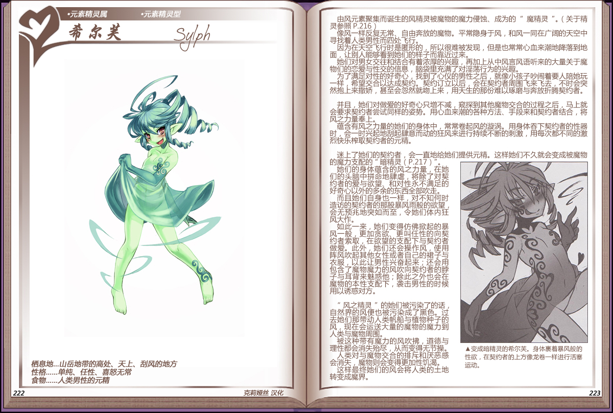

# 希尔芙

|名称|希尔芙|
|:-:|:-:|
|种属|元素精灵属|
|类型|元素精灵型|
|栖息地|山岳地带的高处、天上、刮风的地方|
|性格|单纯、任性、喜怒无常|
|食物|人类男性的元精|

由风元素聚集而诞生的风精灵被魔物的魔力侵蚀、成为的[魔精灵](资料元素精灵.md#2魔性在体内寄宿的魔精灵)。

像风一样反复无常、自由奔放的魔物。平常隐身于风，和风一同在广阔的天空中寻找着人类男性而四处飞行。

因为在天空飞行时是匿形的，所以很难被发现，但是也常常心血来潮地降落到地面，让别人能够看到她们的样子而靠近过来。

她们对男女交往和结合有着浓厚的兴趣，再加上从风言风语中听来的大量关于魔物们的恋爱与性交的信息，脑袋里充满了对淫荡行为的兴趣。

为了满足对性的好奇心，找到了心仪的男性之后，就像小孩子吵闹着要人陪她玩一样，希望交合以达成契约。契约订立以后，会在契约者周围飞来飞去，不时会突然抱上来撒娇，甚至会忽然就吻上来，用天生的那份难以琢磨与奔放折腾契约者。

并且，她们对做爱的好奇心只增不减，窥探到其他魔物交合的过程之后，马上就会要求契约者尝试同样的姿势。用心血来潮的各种方法、手段来和契约者结合，将风之力量奉上。

蕴含有风之力量的她们的身体中，常常卷起风的游旋涡。用身体吞下契约者的性器时，会一时兴起地刮起肆意而动的狂风来进行持续不断的刺激，用每次都不同的激烈快乐榨取契约者的元精。

 

迷上了她们的契约者，会一直地给她们提供元精。这样她们不久就会变成被魔物的魔力支配的[“暗精灵”](资料元素精灵.md#3创造出魔界的暗精灵)。

她们的身体蕴含的风之力量，在她们的头脑中拼命地肆虐，将除了对契约者的爱与欲望、和对性永不满足的好寄心以外的多余的东西全部吹走。而且她们自身也一样，对不知何时造访的契约者的那股暴风雨般的欲望会无预兆地突如而至，令她们体内狂风大作。

如此一来，她们变得仿佛起的暴风一般，更加贪欲、更叫任性的向契约者索取，在欲望的支配下与契约者做爱。此外，她们还会操作风，使用阵风吹起其他女性或者自已的裙子与衣服，以此让男性兴奋起来，还会用包含了魔物魔力的风吹向契约者的脖子与耳背来魅惑他：除此之外也会在魔物的本性支配下，袭击男性的时候角以诱惑对方。

 

“风之精灵”的她们被污染了的话自然界的风便也被污染成了黑色。过去她们那带动人类帆船与植物种子的风，现在会运送大量的魔物的魔力到人类与魔物周围。

被这种带有魔力的风吹拂，道德与理性都会消失尽，从而变得无节操人类对与魔物交合的排斥和厌恶感会消失，魔物则会变得更加性饥渴。

这样最终她们的风会将人类的土地转变成魔界。

---

附图： 