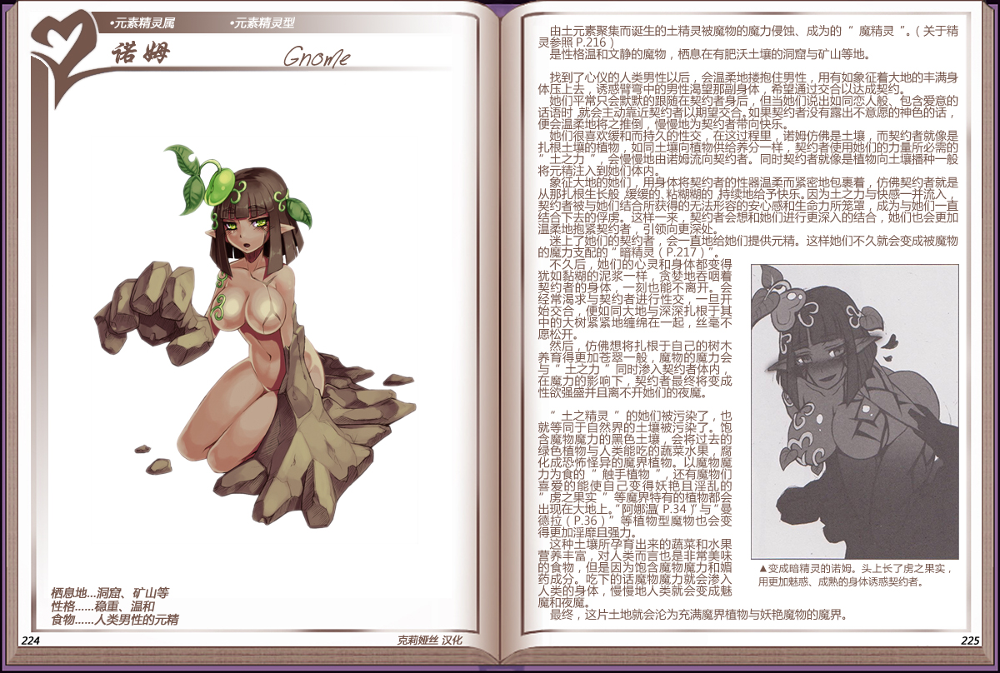

# 诺姆

|名称|诺姆|
|:-:|:-:|
|种属|元素精灵属|
|类型|元素精灵型|
|栖息地|洞窟、矿山等|
|性格|稳重、温和|
|食物|人类男性的元精|

由士元素聚集而诞生的土精灵被魔物的魔力侵蚀、成为的[魔精灵](资料元素精灵.md#2魔性在体内寄宿的魔精灵)。

是性格温和文静的魔物，栖心在有肥沃士壤的洞窟与矿山等地。

找到了心仪的人类男性以后，会温柔地楼抱住男性，用有如象征着大地的丰满身体压上去，诱惑臂弯中的男性渴望那副身体，希望通过交合以达成契约。

 

她们平常只会默默的跟随在契约者身后，但当她们说出如同恋人般、包含爱意的话语时就会主动靠近契约者以期望交合。如果契约者没有露出不意愿的神色的话，便会温柔地将之推倒，慢慢地为契约者带向快乐。

她们很喜欢缓和而持久的性交，在这过程里，诺姆仿佛是士壤，而契约者就像是扎根土壤的植物，如同土壤向植物供给养分一样，契约者使用她们的力量所必需的“土之力”，会慢慢地由诺姆流向契约者。同时契约者就像是植物向土壤播种一般将元精注入到她们体内。

象征大地的她们，用身体将契约者的性器温柔而紧密地包裹着，仿佛契约者就是从那扎根生长般缓缓的、粘糊糊的持续地给予快乐。因为土之力与快感一并流入，契约者被与她们结合所获得的无法形容的安心感和生命力所笼罩，成为与她们一直结合下去的俘虏。这样一来，契约者会想和她们进行更深入的结合，她们也会更加，温柔地抱紧契约者，引领向更深处。

迷上了她们的契约者，会一直地给她们提供元精。这样她们不久就会变成被魔物的魔力支配的[“暗精灵”](资料元素精灵.md#3创造出魔界的暗精灵)。

不久后，她们的心灵和身体都变得犹如黏糊的泥浆一样，贪地吞咽着契约者的身体，一刻也能不离开。会经常渴求与契约者进行性交，一旦开始交合，便如同大地与深深扎根于其中的大树紧紧地缠绵在一起，丝毫不愿松开。

然后，仿佛想将扎根于自己的树木养育得更加苍翠一般，魔物的魔力会与“土之力”同时渗入契约者体内，在魔力的影响下，契约者最终将变成性欲强盛并且离不开她们的夜魔。

 

“土之精灵”的她们被污染了，也就等同于自然界的土壤被污染了。饱含魔物魔力的黑色土壤，会将过去的绿色植物与人类能吃的蔬菜水果，腐化成恐怖怪异的魔界植物。以魔物魔力为食的”触手植物”，还有魔物们喜爱的能使自己变得妖艳且淫乱的“虏之果实”等魔界特有的植物都会出现在大地上。[“阿娜温”](12阿娜温.md)与[“曼德拉”](13曼德拉草.md)等植物型魔物也会变得更加淫靡且强力。

这种土壤所孕育出来的蔬菜和水果营养羊富，对人类而言也是非常美味的食物，但是因为饱含魔物魔力和媚药成分。吃下的话魔物魔力就会渗入人类的身体，慢慢地人类就会变成魅魔和夜魔。

最终，这片土地就会沦为充满魔界植物与妖艳魔物的魔界。

---

附图： 