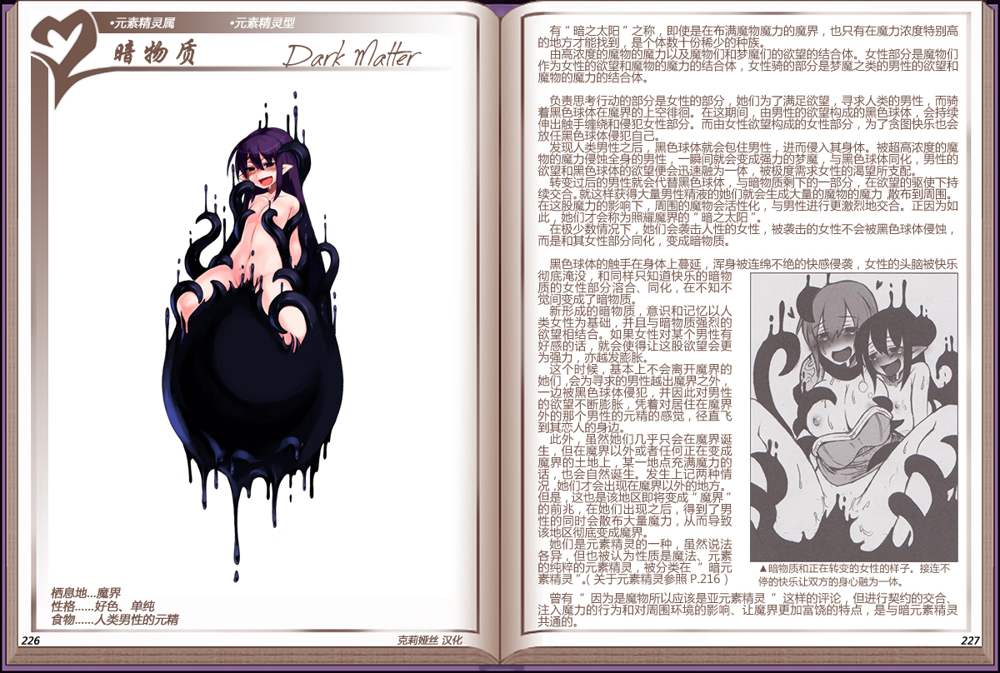

# 暗物质

|名称|暗物质|
|:-:|:-:|
|种属|元素精灵属|
|类型|元素精灵型|
|栖息地|魔界|
|性格|好色、单纯|
|食物|人类男性的元精|

有“暗之太阳“之称，即使是在布满魔物魔力的魔界，也只有在魔力浓度特别高的地方才能找到，是个体数十分稀少的种族。

由高浓度的魔物的魔力以及魔物们和梦魔们的欲望的结合体。女性部分是魔物们作为女性的欲望和魔物的魔力的结合体，女性骑的部分是梦魔之类的男性的欲望和魔物的魔力的结合体。

 

负责思考行动的部分是女性的部分，她们为了满足欲望，寻求人类的男性，而骑着黑色球体在魔界的上空徘徊。在这期间，由男性的欲望构成的黑色球体，会持续伸出触手缠绕和侵犯女性部分。而由女性欲望构成的女性部分，为了贪图快乐也会放任黑色球体侵犯自己。

发现人类男性之后，黑色球体就会包住男性，进而侵入其身体。被超高浓度的魔物的魔力侵蚀全身的男性，一瞬间就会变成强力的梦魔，与黑色球体同化，男性的欲望和黑色球体的欲望便会迅速融为一体，被极度需求女性的渴望所支配。

转变过后的男性就会代替黑色球体，与暗物质剩下的一部分，在欲望的驱使下持续交合。就这样获得大量男性精液的她们就会生成大量的魔物的魔力，散布到周围。在这股魔力的影响下，周围的魔物会活性化，与男性进行更激烈地交合。正因为如此，她们才会称为照耀魔界的“暗之太阳”。

在极少数情况下，她们会袭击人性的女性，被袭击的女性不会被黑色球体侵蚀而是和其女性部分同化，变成暗物质。

 

黑色球体的触手在身体上蔓延，浑身被连绵不绝的快感侵袭，女性的头脑被快乐彻底淹没，和同样只知道快乐的暗物质的女性部分溶合、同化，在不知不觉间变成了暗物质。

新形成的暗物质，意识和记忆以人类女性为基础，并且与暗物质强烈的欲望相结合。如果女性对某个男性有好感的话，就会使得让这股欲望会更为强力，亦越发膨胀。

这个时候，基本上不会离开魔界的她们，会为寻求的男性越出魔界之外，一边被黑色球体侵犯，并因此对男性的欲望不断膨胀，凭着对居住在魔界外的那个男性的元精的感觉，径直飞到其恋人的身边。

此外，虽然她们几乎只会在魔界诞生，但在魔界以外或者任何正在变成魔界的士地上，某一地点充满魔力的话，也会自然诞生。发生上记两种情况，她们才会出现在魔界以外的地方。但是，这也是该地区即将变成“魔界”的前兆，在她们出现之后，得到了男性的同时会散布大量魔力，从而导致该地区彻底变成魔界。

她们是元素精灵的一种，虽然说法各异，但也被认为性质是魔法、元素的纯粹的元素精灵，被分类在[“暗元素精灵”](资料元素精灵.md#3创造出魔界的暗精灵)。

 

曾有“因为是魔物所以应该是亚元素精灵”这样的评论，但进行契约的交合，注入魔力的行为和对周环境的影响、让魔界更加富饶的特点，是与暗元素精灵共通的。

---

附图： 