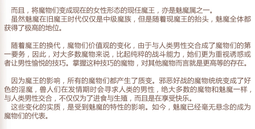

# MGEchm - 《魔物娘图鉴速查手册》V0.11

为了能速查魔物娘图鉴的内容，特此开始制作这个CHM。

## 共建号召

古早的图鉴相关内容已经只剩下图片，目前需要重新录入为文本。
就算有ORC工具辅助，这对我本人来说依然是一项巨大的工程。
因此，在此我号召有兴趣有空闲的爱好者们能参与到该项目的共建中，一起完成这个手册。

### 参与方法

图鉴的图片版本已经存放于仓库中，位于"MGE1\img\魔物娘图鉴I"。

- **文字提取**
    - 利用文字提取工具，将内容文本化，并通过issues或在交流群内提交给我，由我进行下一步的整理。
    - 格式要求：
        - 请参照原图的格式，每段之间空行，原图中若有空行则再多空一行。
        - 同时请注明序号或页码。
        - 示例：
<table border="1">
<tr><td></td><td>而且，将魔物们变成现在的女性形态的现任魔王，亦是魅魔属之一。  虽然魅魔在旧魔王时代仅仅是中级魔族，但是随着现魔王的抬头，魅魔全体都获得了极高的地位。   随着魔王的换代，魔物们价值观的变化，由于与人类男性交合成了魔物们的第一要务，因此，对大多数魔物来说，比起纯粹的战斗能力，她们更为重视诱惑或者让男性愉悦的技巧。掌握这种技巧的魔物，对其他魔物而言就是更高等的存在。   因为魔王的影响，所有的魔物们都产生了质变。邪恶好战的魔物统统变成了好色的淫魔，兽人们在发情期时会寻求人类的男性，绝大多数的魔物和魅魔一样，与人类男性交合，不仅仅为了进食与生殖，而且是在享受快乐。  这些变化的实质，是受到魅魔的特性的影响。如今，魅魔已经毫无悬念的成为魔物们的代表。</td></tr>
</table>

- **Html页面制作**
    - 如果你明白如何使用Github提交修改，有余力且有撰写Html代码的能力（或者愿意通过模仿已有代码学习一下怎么写），就请直接以"MGE1/01魅魔.htm"这个文件为模板，将你在上一步提取出的文本制作成相似的文件并通过github提交至仓库，感谢你的贡献！
    - 格式要求：
        - 模仿"MGE1/01魅魔.htm"这个文件即可。
    - 完成后，请编辑一下该md文件的“当前进度速查”部分，方便其他编辑者了解进度。

### 当前进度速查

当前完成进度速查，以方便爱好者们共建确认工作量。

**《魔物娘图鉴1》**

| 标题         | 页码       | 状态  |
|------------|----------|-----|
| 序言         | 003      | 已录入 |
| 目录         | 004-005  | 已录入 |
| 资料·魔物      | 006-007  | 已录入 |
| 01.魅魔      | 008-009  | 已录入 |
| 02.次级魅魔    | 010-011  | 已录入 |
| 资料·魔物化     | 012-013  | 已录入 |
| 资料·关于元精与魔力 | 014-015  | 已录入 |
| 03.史莱姆     | 016-017  | 已录入 |
| 04.红色史莱姆   | 018-019  | 已录入 |
| 05.史莱姆女王   | 020-021  | 已录入 |
| 06.哥布林     | 022-023  | 已录入 |
| 07.大哥布林    | 024-025  | 已录入 |
| 08.狼人      | 026-027  | 已录入 |
| 09.猫人      | 028-029  | 已录入 |
| 10.兔人      | 030-031  | 已录入|
| 11.绵羊人     | 032-033  | 已录入|
| 12.阿娜温     | 034-035  | 已录入 |
| 13.曼德拉草    | 036-037  | 已录入 |
| 14.玛坦戈     | 038-039  | 已录入 |
| 15.树妖    | 040-041  | 已录入 |
| 16.蜜蜂    | 042-043  | 已录入 |
| 17.大黄蜂   | 044-045  | 已录入 |
| 18.灰熊    | 046-047  | 已录入 |
| 19.哈比    | 048-049  | 已录入 |
| 20.黑色哈比  | 050-051  | 已录入 |
| 21.鸡蛇兽   | 052-053  | 已录入 |
| 22.半兽人   | 054-055  | 已录入 |
| 23.食人魔   | 056-057  | 已录入 |
| 24.阿拉克尼  | 058-059  | 已录入 |
| 25.拉米亚   | 060-061  | 已录入 |
| 26.美杜莎   | 062-063  | 已录入 |
| 27.厄喀德娜  | 064-065  | 已录入 |
| 28.蜥蜴人   | 066-067  | 已录入 |
| 29.沙罗曼蛇  | 068-069  | 已录入 |
| 30.蝙蝠人   | 070-071  | 已录入 |
| 31.半人马   | 072-073  | 已录入|
| 32.独角兽   | 074-075  | 已录入 |
| 33.米洛陶洛斯 | 076-077  | 已录入 |
| 34.荷斯陶洛斯 | 078-079  | 已录入 |
| 35.大蚂蚁   | 080-081  | 已录入 |
| 36.阿拉克尼蚁 | 082-083  | 已录入 |
| 37.螳螂    | 084-085  | 已录入 |
| 38.小仙女   | 086-087  | 已录入 |
| 39.小妖精   | 088-089  | 进行中 |
| 40.凉南希   | 090-091  | 进行中 |
| 41.凯斯柏莎  | 092-093  |   |
| 资料·妖精之国  | 094-095  |   |
| 42.精灵    | 096-097  |   |
| 43.黑暗精灵  | 098-099  |   |
| 44.矮人    | 100-101  |   |
| 资料·精灵与矮人  | 102-103  |   |
| 45.亚马逊女战士 | 104-105  |   |
| 46.爱丽丝    | 106-107  |   |
| 47.艾露普    | 108-109  |   |
| 48.独眼巨人   | 110-111  |   |
| 49.美人鱼    | 112-113  |   |
| 50.梅洛     | 114-115  |   |
| 51.海洋主教   | 116-117  |   |
| 52.涅瑞伊得斯  | 118-119  |   |
| 53.斯库拉    | 120-121  |   |
| 54.卡律布狄斯  | 122-123  |   |
| 55.海生史莱姆 | 124-125  |   |
| 56.塞王    | 126-127  |   |
| 资料·海之魔物  | 128-129  |   |
| 57.沙华鱼人  | 130-131  |   |
| 58.湿地史莱姆 | 132-133  |   |
| 59.巨大老鼠  | 134-135  |   |
| 60.大型蝠螂  | 136-137  |   |
| 61.魔虫    | 138-139  |   |
| 62.罗帕    | 140-141  |   |
| 63.魔像    | 142-143  |   |
| 64.石像鬼   | 144-145  |   |
| 65.宝箱怪   | 146-147  |   |
| 66.壶魔人   | 148-149  |   |
| 67.木乃伊   | 150-151  |   |
| 68.阿努比斯  | 152-153  |   |
| 69.斯芬克斯  | 154-155  |   |
| 70.蝎子人   | 156-157  |   |
| 71.丧尸    | 158-159  |   |
| 72.食尸鬼   | 160-161  |   |
| 73.幽灵    | 162-163  |   |
| 74.骷髅    | 164-165  |   |
| 75.梦魇    | 166-167  |   |
| 76.重身幽灵  | 168-169  |   |
| 77.杜拉罕   | 170-171  |   |
| 78.吸血鬼   | 172-173  |   |
| 79.小恶魔   | 174-175  |   |
| 80.黑暗史莱姆 | 176-177  |   |
| 81.别西卜   | 178-179  |   |
| 82.巴风特   | 180-181  |   |
| 83.魔女    | 182-183  |   |
| 资料·萨巴斯   | 184-185  |   |
| 资料·魔物的魔法 | 186-187  |   |
| 84.妖狐    | 188-189  |   |
| 85.雪女    | 190-191  |   |
| 86.赤鬼    | 192-193  |   |
| 87.乌鸦天狗  | 194-195  |   |
| 88.河童    | 196-197  |   |
| 89.女郎蜘蛛  | 198-199  |   |
| 90.狐仙    | 200-201  |   |
| 资料·日本    | 202-203  |   |
| 91.天使         | 204-205  |   |
| 92.黑暗天使       | 206-207  |   |
| 93.黑暗祭祀       | 208-209  |   |
| 资料·神之眷属与世界的构造 | 210-213  |   |
| 94.龙          | 214-215  |   |
| 资料·元素精灵       | 216-217 |   |
| 95.温蒂妮        | 218-219   |   |
| 96.伊格尼斯       | 220-221 |   |
| 97.希尔芙        | 222-223   |   |
| 98.诺姆         | 224-225   |   |
| 99.黑暗物质       | 226-227  |   |
| 资料·魔界         | 228-229 |   |
| 资料·魔王希冀的理想乡   | 230-231  |   |
| 100.莉莉姆       | 232-233  |   |
| 后记            | 235  |   |

<h2>总体完成进度</h2>
  <table border="1">
    <tr>
      <td><b>《魔物娘图鉴1》【正在进行】</b></td>
      <td>文本化：29% 录入：29%</td>
    </tr>
    <tr>
      <td>《魔物娘图鉴2》</td>
      <td>文本化：设定部分已完成</td>
    </tr>
    <tr>
      <td>图鉴后续更新</td>
      <td>暂无进度</td>
    </tr>
    <tr>
      <td>《世界导游书1-堕落的少女们》</td>
      <td>暂无进度</td>
    </tr>
    <tr>
      <td>《世界导游书外传1-多拉贡尼亚》</td>
      <td>文本化：已完成</td>
    </tr>
    <tr>
      <td>《世界导游书外传1.5-威尔玛莉娜的新婚旅行记》</td>
      <td>文本化：已完成</td>
    </tr>
    <tr>
      <td>《世界导游书2-魔界自然纪行》</td>
      <td>暂无进度</td>
    </tr>
    <tr>
      <td>《世界导游书外传2-萨尔瓦里希恩~雷斯卡特耶的魔界骑士们》</td>
      <td>文本化：已完成</td>
    </tr>
    <tr>
      <td>《世界导游书3-萨巴斯魔导书》</td>
      <td>文本化：已完成 录入：20%</td>
    </tr>
    <tr>
      <td>《世界导游书外传3-考特阿尔弗~水之都的歌姬们》</td>
      <td>等待汉化</td>
    </tr>
    <tr>
      <td>《调查报告~魅魔笔记》</td>
      <td>暂无进度</td>
    </tr>
    <tr>
      <td>QA整理</td>
      <td>暂无进度</td>
    </tr>

  </table>

  <h2>相关链接</h2>
  在线版网址：<a href="https://sparkplugws.github.io/index.htm">https://sparkplugws.github.io/index.htm</a> 
  魔物娘图鉴中文维基：
  <a
    href="https://zhmonstergirlencyclopedia.miraheze.org/wiki/%E9%AD%94%E7%89%A9%E5%A8%98%E5%9B%BE%E9%89%B4%E4%B8%AD%E6%96%87%E7%BB%B4%E5%9F%BA%E7%A4%BE%E5%8C%BA">
    https://zhmonstergirlencyclopedia.miraheze.org/
  </a> 

  <h2>联系方式</h2>
  对于该项目的改进和纠错建议，请加群870955591联系，或通过Github的Issues提交。 

  

  特别感谢来自魔物娘图鉴WIKI的文本整理，替我剩下了大量精力。 
  也感谢SSTM汉化的各位大佬们这么多年来的辛勤奉献。 
  最后依旧要感谢健康クロス老师长久以来的创作，为我们创造了这样一个幻想世界。 
